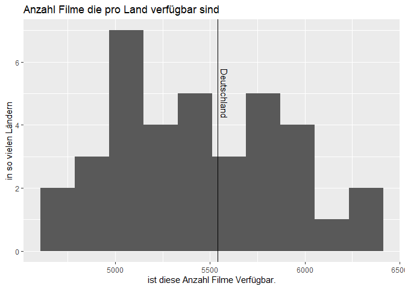
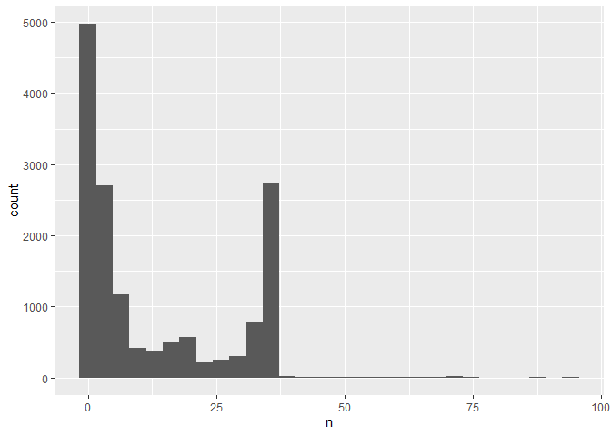

R-Projekt
================
Márk Reichmann, Simon Keil, Daniel Henke
6 1 2022

Die Daten sind von
<https://www.kaggle.com/ashishgup/netflix-rotten-tomatoes-metacritic-imdb>

Daten einlesen:

``` r
library("tidyverse")
data <- read_csv("Data/netflix-rotten-tomatoes-metacritic-imdb.csv")
```

bisherige Fragestellungen:

*Welches Land hat das beste Netflix?*

filme/Serien getrennt

    Land - einnahmen
          (in welhem Land verdient Netflix am meisten?)
    Sprache - bewerrtungen 
          (in welcher sprache gibt es den höchsten prozentsatz "guter" filme?)
    Land - Anzahl pro Genere
          (gibts mehr deutsche Krimis als Französische?)
    land - Schuspieler
          (sind in jedem land verschiedene Schauspieler beliebt?)
    Land - Sprache 
          (zB Finnland soll keine Synchros machen)

Achtung: Sprache evtl nicht vertrauenswürig

zB hypothesentest: ich glaube, deutschland schaut viele krimis, und
Finnland hat keine übersetzungen

Schätzer für Varianz, Erwartungswert

## Explorative Datenanalyse

Zunächst schauen wir uns an, wieviele Filme und Serien es pro Land gibt
und in wievielen Ländern Filme und Serien verfügbar sind.

``` r
title_country <- data%>%
  select('Country Availability', Title) %>% 
  rename(country = 'Country Availability') %>% 
  separate_rows(country, sep = ",") %>% 
  drop_na()

n_ger <- (title_country %>%
            filter(country == "Germany") %>%
            count())$n

title_country %>%
  count(country) %>% 
  ggplot(mapping = aes(x = n)) +
  geom_histogram(bins = 10) +
  annotate(geom = "vline",
           x = n_ger,
           xintercept = n_ger) +
  annotate(geom = "text",
           label = "Deutschland",
           x = n_ger,
           y = 5,
           angle = -90,
           vjust = -0.5) +
  labs(title = "Anzahl Filme die pro Land verfügbar sind",
       x = "Anzahl Filme")
```

    ## Warning: Ignoring unknown aesthetics: x

<!-- -->

``` r
title_country %>% 
  count(Title) %>%
  ggplot(mapping = aes(x = n)) +
  geom_histogram(boundary = 0, bins = 95) +
  labs(title = "Anzahl Länder in denen Filme verfügbar sind",
       x = "Anzahl Länder")
```

<!-- -->
Nun untersuchen wir die Genres

``` r
data %>% 
  drop_na %>% 
  select(Genre) %>%
  separate_rows(Genre, sep = ", ") %>%
  count(Genre) %>% 
  arrange(desc(n)) %>% 
  slice(1:10) %>% 
  ggplot(aes(x = factor(Genre, levels = Genre), y = n)) +
  geom_bar(stat = 'identity') +
  labs(title = "Top 10 der Genre",
    x = "Genre",
    y = "Anzahl") +
  theme(axis.text.x = element_text(angle = 45, hjust=1))
```

<!-- -->

``` r
data %>% 
  drop_na %>% 
  rename(Country = 'Country Availability') %>% 
  select(Genre, Country) %>%
  separate_rows(Country, sep = ",") %>%
  separate_rows(Genre, sep = ", ") %>%
  filter(Country == 'Germany') %>% 
  count(Genre) %>% 
  arrange(desc(n)) %>% 
  slice(1:10) %>% 
  ggplot(aes(x = factor(Genre, levels = Genre), y = n)) +
  geom_bar(stat = 'identity') +
  labs(title = "Top 10 der Genre in Deutschland",
    x = "Genre",
    y = "Anzahl") +
  theme(axis.text.x = element_text(angle = 45, hjust=1))
```

<!-- -->
