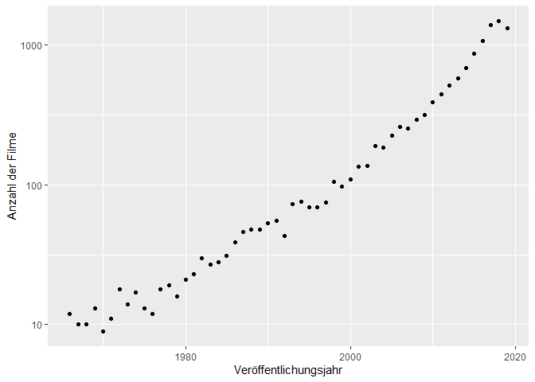

R-Projekt
================
Márk Reichmann, Simon Keil, Daniel Henke

Fragestunde: reicht eine Regression?

*Netflix im zeitlichen Verlauf*

-   Einleitung:

    -   wie verändert sich das neuere vs ältere material aus Netflix?
        (release year, not Neflix release Year!) (Daniel)

-   Explorativ:

    -   Datenbasis umstellen:
        -   wir betrachten nur spalten ohne NA werte
        -   varaiblen: titel, release_date, Genre(getrennt),
            land(getrennt)
    -   anzahl Filme pro Land (balkendiagramm/blaue punkte ?)
    -   länder pro film im zeitlichen Verlauf(Daniel)
    -   genre (Márk)
    -   release Year vs genre Genres (Márk)
    -   Jahr vs Anzahl Genre (verfügbar auf Netflix)(Márk)
    -   Jahr vs Anzahl Genre (pro film) (neueren Filme nicht vielen
        Genren zugeordnet) (Márk)

-   Methoden

    -   lineare regression, was ist das? (Simon)
    -   falls in 4. was besonderes, dann noch ergänzen
    -   pure exzellenz: lineare regression wird durch least squares
        bestimmt (vgl Bornemann, literatur :))

-   Analyse

    -   y-achsenabschnitt relativ witzloß (Simon)
    -   lineare regression (mit residuen, koeffizienten(pro jahr wie
        viele genres durchschnittlich)) \[macht der computer\]
    -   beschreibung, was wir sehen
    -   kritisch hinterfragen, ob netflix spezifisch (Daniel)

## Einleitung

Als 1997 ein kleine Online-Videothek für DVDs in Kalifornien gegründet
wurde, war niemanden klar, wie dieses Unternehmen die Welt verändern
würde. Jetzt, knapp 25 Jahre später, ist Netflix der größte
Video-on-Demand-Anbieter der Welt mit knapp 200 Millionen Abonnenten
\[1\]. Der Streaming-Riese ist heute in mehr als 190 Ländern verfügbar
und hat tausende Inhalte in verschieden Sprachen \[2\].

Hierbei hat Netflix eine große Bandbreite an Filmen und Serien in
verschiedensten Genres und aus verschiedenen Jahren. Netflix kauft und
produziert Inhalte oft nach Daten, sodass ihr Sortiment keiner wahllosen
Zusammenstellung sondern eher einer kuratierten Auswahl gleicht \[3\].

Dadurch ist die Auswahl, welche Inhalte auf Netflix verfügbar sind und
wie diese im Zusammenhang mit Genre, Erscheinungsjahr und weiteren
Charakteristika zusammengestellt sind, um einiges spannender.
Insbesondere erweist der Vergleich von älteren und neueren Inhalten
spannend. Deshalb wollen wir in diesem Bericht der Frage nachgehen: *wie
verhalten sich die Inhalte auf Netflix bezüglich ihres
Erscheinungsjahr?*

Hierzu haben wir Daten von Kaggle, genauer gesagt von Ashish Gupta,
unter
<https://www.kaggle.com/ashishgup/netflix-rotten-tomatoes-metacritic-imdb>.
Da es keine offizielle Netflix API gibt, wurden hier Daten von mehreren
verschiedenen APIs und Seiten wie “Rotten Tomatoes”, “iMDB” und weiteren
Quellen zusammengetragen. Zudem hat er eine eigene Metrik, den “Hidden
Gem Score”, hinzugefügt, der aus den Daten Geheimtipps ermitteln soll.
Diesen haben wir aber für unsere Betrachtungen nicht beachtet.

Aufgrund der Heterogenität der Daten sind manche Variablen
vertrauenswürdiger als andere. Zum Teil scheinen die Sprachen nicht
akurat zu sein, auch Sprachen wie “Latin” werden genannt, die wir in
keinem Film auf Netflix finden konnten. Wir vermuten Übersetzungsfehler,
können aber den Fehlerursprung nicht eindeutig ermitteln. Zum Teil sind
auch bei Zusammenfügen der Daten aus verschiedenen Quellen Fehler
aufgetreten. So ist vermutlich bei der Serie “Barberen??????” die
Netflix-Serie deutscher Herkunft mit dem iMDB-Eintrag tschechischen Film
???? aus 20?? verbunden wurden. Die Daten sind zum Teil von der Serie,
zum Teil vom Film.

Da dies aber (nach unserem Wissen) Einzelfälle sind und es zu diesem
Thema kaum bis keine besseren Daten gibt, haben wir trotz dieser
Probleme dieses Datenset verwendet.

Teilweise tauchen Filme öfter auf, um diese Duplikate müssen wir uns
speziell kümmern.

## Explorative Datenanalyse

*Anmerkung zu Beginn der Analyse:* Wir lesen vor der eigentlichen
Auswertung die Daten ein und reduzieren sie auf den Grund-Datenbestand,
den wir im Folgenden nutzen wollen: Die Spalten mit dem Titel, Genres,
Veröffentlichungsdatum und Länder Verfügbarkeit. Dabei enfernen wir
zudem alle Zeilen in denen Angaben fehlen sowie die Filme/Serien mit
Veröffentlichungsdatum vor 1965 und nach 2020, da in diesen Jahren nur
sehr wenige Einträge vorhanden sind, sodass keine sinvollen Aussagen
getroffen werden können.

Zunächst schauen wir uns ein paar allgemeine Zahlen zu unserem
(aufgeräumten) Datensatz an. Wir beginnen mit einer statistischen
Übersicht zu den Veröffentlichungsjahren:

    ##    Min. 1st Qu.  Median    Mean 3rd Qu.    Max. 
    ##    1966    2008    2015    2011    2017    2019

Wir beobachten zum einen, dass nur noch Werte von 1961 bis 2019 im
Datensatz sind (wie oben begründet) und zum anderen, dass sehr viele
Filme aus den letzten Jahren stammen, allein 25% aus den Jahren 2017 bis
2019. Diese Beobachtung sieht man auch, wenn man die Zahl der Filme in
dem jeweiligen Veröffentlichungsjahr darstellt. Da der Zusammenhang
annährend exponentiell ist, ist die Anzahl im Plot mit einer
logarithmischen Skala versehen.
<!-- -->

Nun schauen wir uns die Länder in unserem Datensatz etwas genauer an. Es
gibt

    ## [1] 36

Länder in unserem Datensatz. Eine interessante Kenngröße ist, wieviele
Filme und Serien es jeweils in den Ländern gibt.

<!-- -->

Man sieht, dass es starke Unterschiede zwischen den einzelnen Ländern
gibt und dass keine Gruppenbildung in z.B. Länder mit sehr viel und
Ländern mit weniger Filmtiteln zu erkennen ist.

Eine naheliegende Folgerung wäre, dass die Auswahl an Filmen in vielen
Ländern ähnlich ist. Das würde bedeuten, dass die meisten Filme in fast
allen Ländern verfügbar sind. Dem ist aber nicht so:

    ## # A tibble: 13 x 3
    ##    Title                       year     n
    ##    <chr>                      <dbl> <int>
    ##  1 "Champions"                 2018     2
    ##  2 "Gold"                      2017     3
    ##  3 "Heidi"                     2015     2
    ##  4 "I Am"                      2011     2
    ##  5 "Kakegurui"                 2018     2
    ##  6 "Kingdom"                   2019     3
    ##  7 "Love and Lies"             2017     2
    ##  8 "Meridian"                  2016     2
    ##  9 "Midnight Diner"            2015     3
    ## 10 "My Babysitters a Vampire"  2011     3
    ## 11 "Revenge"                   2018     2
    ## 12 "Spark"                     2017     2
    ## 13 "Ver\xf3nica"               2017     2

    ## # A tibble: 7 x 3
    ##   Title             year     n
    ##   <chr>            <dbl> <int>
    ## 1 "Champions"       2018    37
    ## 2 "Heidi"           2015    45
    ## 3 "Kakegurui"       2018    72
    ## 4 "Kingdom"         2019   105
    ## 5 "Meridian"        2016    65
    ## 6 "Midnight Diner"  2015    72
    ## 7 "Ver\xf3nica"     2017    64

    ## # A tibble: 52 x 4
    ##    country       year Title                             Genre                   
    ##    <chr>        <dbl> <chr>                             <chr>                   
    ##  1 France        2009 Cloudy with a Chance of Meatballs Adventure, Animation, C~
    ##  2 Japan         2009 Cloudy with a Chance of Meatballs Adventure, Animation, C~
    ##  3 South Korea   2009 Cloudy with a Chance of Meatballs Adventure, Animation, C~
    ##  4 Belgium       2009 Cloudy with a Chance of Meatballs Adventure, Animation, C~
    ##  5 South Africa  2009 Cloudy with a Chance of Meatballs Adventure, Animation, C~
    ##  6 Switzerland   2009 Cloudy with a Chance of Meatballs Adventure, Animation, C~
    ##  7 Canada        2009 Cloudy with a Chance of Meatballs Adventure, Animation, C~
    ##  8 Brazil        2009 Cloudy with a Chance of Meatballs Adventure, Animation, C~
    ##  9 Netherlands   2009 Cloudy with a Chance of Meatballs Adventure, Animation, C~
    ## 10 Israel        2009 Cloudy with a Chance of Meatballs Adventure, Animation, C~
    ## # ... with 42 more rows

<!-- -->

**Untersuchung Internationalität vs. Veröffentlichungsjahr**

*Ebenfalls spannend, evtl. als erweiterung zu Simons Idee (\~Daniel)*

Netflix wird immer internationaler und hat mehr und mehr
Eigenproduktionen. Führt das auf lange Sicht auf ein einheitlicheres
Netflix, das weniger regionale Unterschiede hat? Sind die neusten
Veröffentlichungen auf Netflix in mehr Ländern verfügbar?

Zunächst schauen wir uns die Film basierend auf ihr ursprüngliches
Veröffentlichungsjahr an, wobei wir ähnlich wie oben nur Filme zwischen
1960 und 2021 betrachten. Hier sehen wir eine interessante Kurve,
insbesondere wenn wir die in R eingebaute, automatische Glättungskurve
einbauen.

<!-- -->

Zuletzt untersuchen wir noch die Genres
<!-- -->

und die Genres im zeitlichen Verlauf:
<!-- -->

Trotz (bzw. sogar wegen) des Overplotting sehen wir klar: Mit
zunehmender Jahreszahl gibt es mehr Genres und die einzelnen Genres
tendieren dazu einen kleineren Anteil auszumachen, denn die Punkte
liegen rechts unten im Plot am dichtesten. Zählen wir die Genres pro
Jahr erhalten wir einen annährend linearen Zusammenhang:

<!-- -->

Allerdings wird in unserem Datensatz ein Film i.d.R. mehreren Genres
zugeordnet. Liegt der Zusammenhang also eventuell daran, dass neuere
Filme einfach mehr unterschiedlichen Genres zugeordnet werden? Um das zu
beantworten plotten wir die durchschnittliche Zahl der Genres denen ein
Film in einem gegebenen Jahr zugeordnet wird:

<!-- -->

Anhand des Plots lässt sich diese Vermutung widerlegen, denn die Zahl
der Genres ist fast immer zwischen 2.5 und .5, lediglich vor 1980 sieht
man etwas stärkere Schwankungen die vermutlich darauf zurückzuführen
ist, dass in diesen Jahren die Zahl der Filme die verfügbar sind relativ
klein ist. In den Filmen der letzten Jahre ist sogar eher ein
Abwärtstrend erkennbar.

## Literatur

\[1\] Statista Research Department (2021). *Netflix: Daten und Fakten
zur Erfolgsgeschichte des Streaming-Riesen*.
<https://de.statista.com/themen/1840/netflix/>

\[2\] Netflix. *Where ist Netflix available?.*
<https://help.netflix.com/en/node/14164>

\[3\] Netflix. *How does Netflix license TV shows and movies?.*
<https://help.netflix.com/en/node/4976#>:\~:text=Netflix%20uses%20a%20variety%20of,shows%20and%20movies%20we%20suggest.
