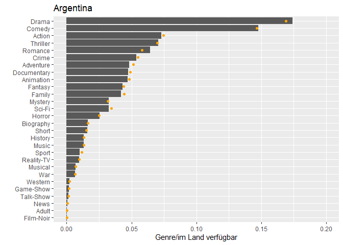
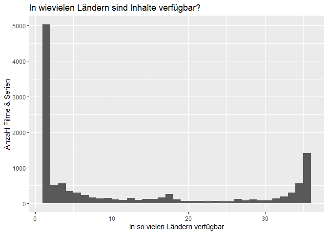
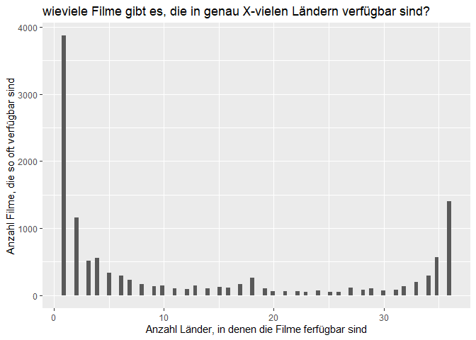
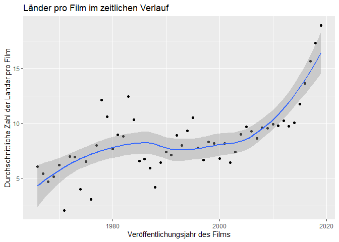
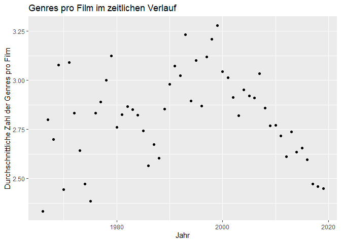
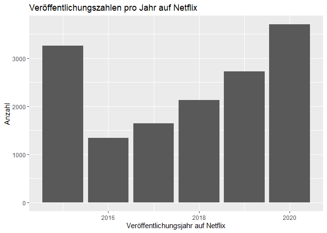
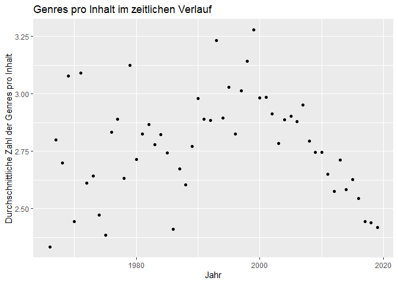

R-Projekt
================
Márk Reichmann, Simon Keil, Daniel Henke

## Einleitung

Als 1997 ein kleine Online-Videothek für DVDs in Kalifornien gegründet
wurde, war niemanden klar, wie dieses Unternehmen die Welt verändern
würde. Jetzt, knapp 25 Jahre später, ist Netflix der größte
Video-on-Demand-Anbieter der Welt mit knapp 200 Millionen Abonnenten
\[1\]. Der Streaming-Riese ist heute in mehr als 190 Ländern verfügbar
und hat tausende Inhalte in verschieden Sprachen \[2\].

Hierbei hat Netflix eine große Bandbreite an Filmen und Serien in
verschiedensten Genres und aus verschiedenen Jahren. Netflix kauft und
produziert Inhalte oft nach Daten, sodass ihr Sortiment keiner wahllosen
Zusammenstellung sondern eher einer kuratierten Auswahl gleicht \[3\].

Dadurch ist die Auswahl, welche Inhalte auf Netflix verfügbar sind und
wie diese im Zusammenhang mit Genre, Erscheinungsjahr und weiteren
Charakteristika zusammengestellt sind, sehr spannend und weit mehr als
nur ein Querschnitt aller produzierten Inhalte. Insbesondere erweist
sich der Vergleich von älteren und neueren Inhalten als spannend.
Deshalb wollen wir in diesem Bericht der Frage nachgehen: *Wie verhalten
sich die Inhalte auf Netflix bezüglich ihres Erscheinungsjahres?*

Hierzu benutzen wir einen Datensatz von Kaggle, den Ashish Gupta
zusammen- und zur Verfügung gestellt hat und der unter \[4\] abzufurfen
ist. Da es keine offizielle Netflix-API gibt, wurden hier Daten von
mehreren verschiedenen APIs und Seiten wie “Rotten Tomatoes”, “iMDB” und
weiteren Quellen zusammengetragen. Zudem hat er eine eigene Metrik, den
“Hidden Gem Score”, hinzugefügt, der aus den Daten Geheimtipps ermitteln
soll. Diesen haben wir aber für unsere Betrachtungen nicht beachtet, da
es sich lediglich um einen aus den anderen Variablen erzeugten Wert
handelt.

Im Datensatz finden sich 29 Variablen pro Inhalt, die vom Titel über
verschiedene Genre-Variablen bis hin zu Regisseur und Schauspieler
reichen. Ebenfalls verfügbar sind die verfügbaren Sprachen, verschiedene
Bewertungsmetriken (von IMDb, Rotten Tomatoes, Metacritic) und weitere
Kenngrößen, mit denen wir uns nicht weiter befasst haben. Im Folgenden
haben wir vor allem das Veröffentlichungsjahr, die Genres und die
Länderverfügbarkeit sowie ihre Zusammenhänge untersucht.

Da die Daten aus unterschiedlichen Quellen kommen und somit sehr
heterogen sind, sind manche Variablen vertrauenswürdiger als andere.
Teilweise tauchen Filme und Serien mehrmals auf, um diese Duplikate
müssen wir uns speziell kümmern. Zum Teil scheinen die Sprachen nicht
vollständig richtig zu sein, da zum Beispiel auch “Latin” als Sprache
genannt wird, was wir durch manuelles Abgleichen mit Netflix nicht
bestätigen konnten. Wir vermuten Übersetzungsfehler, können aber den
Fehlerursprung nicht eindeutig ermitteln. Manchmal sind auch bei
Zusammenfügen der Daten aus verschiedenen Quellen Fehler aufgetreten. So
ist vermutlich bei der Serie “Barbarians” die Netflix-Serie deutscher
Herkunft mit dem iMDB-Eintrag des tschechischen Films “Barbarians” (im
Original “Varvari”) aus 2014 verbunden worden. Die Daten sind zum Teil
von der Serie, zum Teil vom Film.

Da dies aber (nach unserem Wissen) Einzelfälle sind und es zu diesem
Thema kaum bis keine besseren Daten gibt, haben wir trotz dieser
Probleme dieses Datenset verwendet. Um den Imperfektionen des
Datensatzes zusätzlich aus dem Weg zu gehen, haben wir uns zudem auf
Spalten konzentriert, die sehr vollständig sind und in denen uns keine
offensichtlichen Inkonsistenzen aufgefallen sind.

## Explorative Datenanalyse

*Anmerkung zu Beginn der Analyse:* Wir lesen vor der eigentlichen
Auswertung die Daten ein und reduzieren sie auf den Grund-Datenbestand,
den wir im Folgenden nutzen wollen: Die Spalten mit dem Titel, Genres,
Veröffentlichungsdatum und Länder Verfügbarkeit. Dabei enfernen wir
zudem alle Zeilen in denen Angaben fehlen sowie die Filme/Serien mit
Veröffentlichungsdatum vor 1965 und nach 2020, da in diesen Jahren nur
sehr wenige Einträge vorhanden sind, sodass keine sinvollen Aussagen
getroffen werden können.

Zunächst schauen wir uns ein paar allgemeine Zahlen zu unserem
(aufgeräumten) Datensatz an. Wir beginnen mit einer statistischen
Übersicht zu den Veröffentlichungsjahren:

    ##    Min. 1st Qu.  Median    Mean 3rd Qu.    Max. 
    ##    1966    2008    2015    2011    2017    2019

Wir beobachten zum einen, dass nur noch Werte von 1961 bis 2019 im
Datensatz sind (wie oben begründet) und zum anderen, dass sehr viele
Filme aus den letzten Jahren stammen, allein 25% aus den Jahren 2017 bis
2019. Diese Beobachtung sieht man auch, wenn man die Zahl der Filme in
dem jeweiligen Veröffentlichungsjahr darstellt. Da der Zusammenhang
annährend exponentiell ist, ist die Anzahl im Plot mit einer
logarithmischen Skala versehen.
<!-- -->

Nun schauen wir uns die Länder in unserem Datensatz etwas genauer an. Es
gibt

    ## [1] 36

Länder in unserem Datensatz. Eine interessante Kenngröße ist, wieviele
Filme und Serien es jeweils in den Ländern gibt.

<!-- -->

Man sieht, dass es starke Unterschiede zwischen den einzelnen Ländern
gibt und dass keine Gruppenbildung in z.B. Länder mit sehr viel und
Ländern mit weniger Filmtiteln zu erkennen ist.

Eine naheliegende Folgerung wäre, dass die Auswahl an Filmen in vielen
Ländern ähnlich ist. Das würde bedeuten, dass die meisten Filme in fast
allen Ländern verfügbar sind. Dem ist aber nicht so:
<!-- -->

Tatsächlich ist ein Großteil der Medien nur in einem einzigen Land
abrufbar, das Angebot von Netflix scheint also recht speziell auf
einzelne Länder zugeschnitten zu sein. Nur im Bereich von knapp 36
Ländern ist ein kleinerer Spike mit fast 1500 sehr international
verfügbaren Inhalten.

Sind diese sehr internationalen Inhalte möglicherweise die neueren
Inhalte auf Netflix? Deshalb wollen wir mal die Internationalität mit
dem Veröffentlichungsdatum vergleichen.

<!-- -->

Hier sehen wir eine interessante Korrelation, die auf eine stärkere
Internationalität hinweist, je neuer der Inhalt ist. Dieser Effekt ist
noch deutlicher sichtbar, wenn wir die automatische Annährungskurve von
R in den Graphen legen. Diese wird mit einer lokalen polynomiellen
Regression (loess) erzeugt, worauf wir uns aber nicht konzentrieren
werden \[QUELLE????\]

<!-- -->

Zuletzt untersuchen wir noch die Genres. Hier fallen starke Unterschiede
zwischen den beliebtesten Genres gegenüber den am wenigsten vorkommenden
Genres auf.

<!-- -->

Wenn wir nun die Genres im zeitlichen Verlauf angucken, bekommen wir ein
interessantes Bild:

<!-- -->

Trotz (bzw. sogar wegen) des Overplotting sehen wir klar: Mit
zunehmender Jahreszahl gibt es mehr Genres und die einzelnen Genres
tendieren dazu einen kleineren Anteil auszumachen, denn die Punkte
liegen rechts unten im Plot am dichtesten. Zählen wir die Genres pro
Jahr erhalten wir einen annährend linearen Zusammenhang:

<!-- -->

Allerdings wird in unserem Datensatz ein Film i.d.R. mehreren Genres
zugeordnet. Liegt der Zusammenhang also eventuell daran, dass neuere
Filme einfach mehr unterschiedlichen Genres zugeordnet werden? Um das zu
beantworten plotten wir die durchschnittliche Zahl der Genres denen ein
Film in einem gegebenen Jahr zugeordnet wird:

<!-- -->

Anhand des Plots lässt sich diese Vermutung widerlegen, denn die Zahl
der Genres ist fast immer zwischen 2.5 und .5, lediglich vor 1980 sieht
man etwas stärkere Schwankungen die vermutlich darauf zurückzuführen
ist, dass in diesen Jahren die Zahl der Filme die verfügbar sind relativ
klein ist. In den Filmen der letzten Jahre ist sogar eher ein
Abwärtstrend erkennbar.

## Methoden

Den annähernd linearen Zusammenhang, auf den wir in der explorativen
Analyse gestoßen sind, wollen wir genauer untersuchen. Hierfür gibt es
die statistische Methode der linearen Regression.

## Ergebnisse und Schlussfolgerungen

## Literatur

\[1\] Statista Research Department (2021). *Netflix: Daten und Fakten
zur Erfolgsgeschichte des Streaming-Riesen*.
<https://de.statista.com/themen/1840/netflix/>

\[2\] Netflix. *Where ist Netflix available?.*
<https://help.netflix.com/en/node/14164>

\[3\] Netflix. *How does Netflix license TV shows and movies?.*
<https://help.netflix.com/en/node/4976#>:\~:text=Netflix%20uses%20a%20variety%20of,shows%20and%20movies%20we%20suggest.

\[4\] Ashish Gupta. *Daten.*
<https://www.kaggle.com/ashishgup/netflix-rotten-tomatoes-metacritic-imdb>
