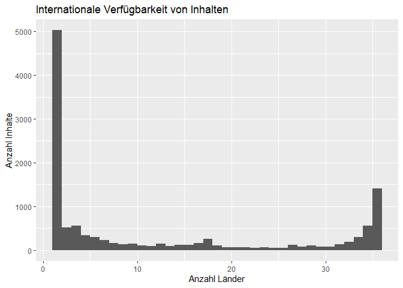
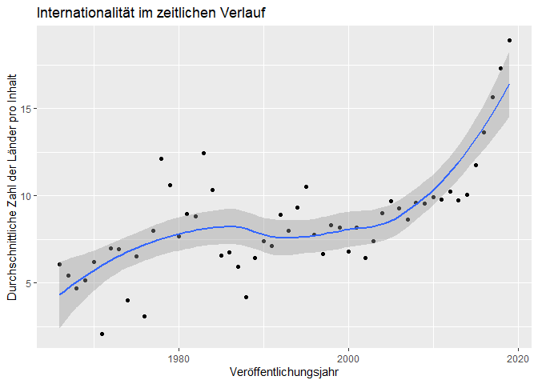
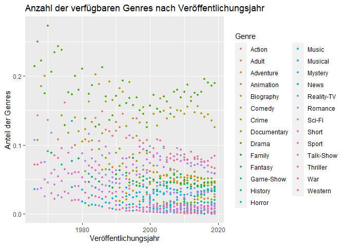

R-Projekt
================
Márk Reichmann, Simon Keil, Daniel Henke

Fragestunde: reicht eine Regression? -> ja!

*Netflix im zeitlichen Verlauf*

-   Einleitung:

    -   wie verändert sich das neuere vs ältere material aus Netflix?
        (release year, not Neflix release Year!) (Daniel)

-   Explorativ:

    -   Datenbasis umstellen:
        -   wir betrachten nur spalten ohne NA werte
        -   varaiblen: titel, release_date, Genre(getrennt),
            land(getrennt)
    -   anzahl Filme pro Land (balkendiagramm/blaue punkte ?)
    -   länder pro film im zeitlichen Verlauf(Daniel)
    -   genre (Márk)
    -   release Year vs genre Genres (Márk)
    -   Jahr vs Anzahl Genre (verfügbar auf Netflix)(Márk)
    -   Jahr vs Anzahl Genre (pro film) (neueren Filme nicht vielen
        Genren zugeordnet) (Márk)

-   Methoden

    -   lineare regression, was ist das? (Simon)
    -   falls in 4. was besonderes, dann noch ergänzen
    -   pure exzellenz: lineare regression wird durch least squares
        bestimmt (vgl Bornemann, literatur :))

-   Analyse

    -   y-achsenabschnitt relativ witzloß (Simon)
    -   lineare regression (mit residuen, koeffizienten(pro jahr wie
        viele genres durchschnittlich)) \[macht der computer\]
    -   beschreibung, was wir sehen
    -   kritisch hinterfragen, ob netflix spezifisch (Daniel)

## Einleitung

Als 1997 ein kleine Online-Videothek für DVDs in Kalifornien gegründet
wurde, war niemanden klar, wie dieses Unternehmen die Welt verändern
würde. Jetzt, knapp 25 Jahre später, ist Netflix der größte
Video-on-Demand-Anbieter der Welt mit knapp 200 Millionen Abonnenten
\[1\]. Der Streaming-Riese ist heute in mehr als 190 Ländern verfügbar
und hat tausende Inhalte in verschieden Sprachen \[2\].

Hierbei hat Netflix eine große Bandbreite an Filmen und Serien in
verschiedensten Genres und aus verschiedenen Jahren. Netflix kauft und
produziert Inhalte oft nach Daten, sodass ihr Sortiment keiner wahllosen
Zusammenstellung sondern eher einer kuratierten Auswahl gleicht \[3\].

Dadurch ist die Auswahl, welche Inhalte auf Netflix verfügbar sind und
wie diese im Zusammenhang mit Genre, Erscheinungsjahr und weiteren
Charakteristika zusammengestellt sind, um einiges spannender.
Insbesondere erweist der Vergleich von älteren und neueren Inhalten
spannend. Deshalb wollen wir in diesem Bericht der Frage nachgehen: *Wie
verhalten sich die Inhalte auf Netflix bezüglich ihres
Erscheinungsjahr?*

Hierzu haben wir Daten von Kaggle, genauer gesagt von Ashish Gupta,
unter
<https://www.kaggle.com/ashishgup/netflix-rotten-tomatoes-metacritic-imdb>.
Da es keine offizielle Netflix API gibt, wurden hier Daten von mehreren
verschiedenen APIs und Seiten wie “Rotten Tomatoes”, “iMDB” und weiteren
Quellen zusammengetragen. Zudem hat er eine eigene Metrik, den “Hidden
Gem Score”, hinzugefügt, der aus den Daten Geheimtipps ermitteln soll.
Diesen haben wir aber für unsere Betrachtungen nicht beachtet.

Im Datensatz finden sich 29 Variablen pro Inhalt, die vom Titel über
verschiedene Genre-Variablen bis hin zu Regisseur und Schauspieler
reichen. Ebenfalls verfügbar sind die verfügbaren Sprachen, verschiedene
Bewertungsmetriken (von IMDb, Rotten Tomatoes, Metacritic) und weitere
Kenngrößen, mit denen wir uns nicht weiter befasst haben. Im folgenden
haben wir uns vor allem auf das Veröffentlichungsjahr, das Genre und die
Länderverfügbarkeit.

Da die Daten aus unterschiedlichen Quellen kommen und somit sehr
heterogen sind, sind manche Variablen vertrauenswürdiger als andere.
Teilweise tauchen Filme und Serien öfters auf, um diese müssen wir uns
speziell kümmern. Zum Teil scheinen die Sprachen nicht akkurat zu sein,
auch Sprachen wie “Latin” werden genannt, die wir in keinem Film auf
Netflix finden konnten. Wir vermuten Übersetzungsfehler, können aber den
Fehlerursprung nicht eindeutig ermitteln. Manchmal sind auch bei
Zusammenfügen der Daten aus verschiedenen Quellen Fehler aufgetreten. So
ist vermutlich bei der Serie “Barbarians” die Netflix-Serie deutscher
Herkunft mit dem iMDB-Eintrag tschechischen Film “Barbarians” (im
Original “Varvari”) aus 2014 verbunden wurden. Die Daten sind zum Teil
von der Serie, zum Teil vom Film.

Da dies aber (nach unserem Wissen) Einzelfälle sind und es zu diesem
Thema kaum bis keine besseren Daten gibt, haben wir trotz dieser
Probleme dieses Datenset verwendet.

## Explorative Datenanalyse

*Anmerkung zu Beginn der Analyse:* Wir lesen vor der eigentlichen
Auswertung die Daten ein und reduzieren sie auf den Grund-Datenbestand,
den wir im Folgenden nutzen wollen: Die Spalten mit dem Titel, Genres,
Veröffentlichungsdatum und Länder Verfügbarkeit. Dabei entfernen wir
zudem alle Zeilen, in denen Angaben fehlen, sowie die Filme/Serien mit
Veröffentlichungsdatum vor 1965 und nach 2020. In diesen Jahren sind
nämlich nur sehr wenige Einträge vorhanden, sodass keine sinnvollen
Aussagen getroffen werden können.

Zunächst schauen wir uns ein paar allgemeine Zahlen zu unserem
(aufgeräumten) Datensatz an. Wir beginnen mit einer statistischen
Übersicht zu den Veröffentlichungsjahren:

    ##    Min. 1st Qu.  Median    Mean 3rd Qu.    Max. 
    ##    1966    2008    2015    2011    2017    2019

Wir beobachten zum einen, dass nur noch Werte von 1961 bis 2019 im
Datensatz sind (wie oben begründet) und zum anderen, dass sehr viele
Inhalte aus den letzten Jahren stammen, allein 25% aus den Jahren 2017
bis 2019. Diese Beobachtung sieht man auch, wenn man die Zahl der Filme
in dem jeweiligen Veröffentlichungsjahr darstellt. Da der Zusammenhang
annähernd exponentiell ist, ist die Anzahl im Plot mit einer
logarithmischen Skala versehen.

<!-- -->

Nun schauen wir uns die Länder in unserem Datensatz etwas genauer an. Es
gibt

    ## [1] 36

Länder in unserem Datensatz. Eine interessante Kenngröße ist, wie viele
Filme und Serien es jeweils in den Ländern gibt.

<!-- -->

Man sieht, dass es starke Unterschiede zwischen den einzelnen Ländern
gibt und dass keine Gruppierungen festzustellen sind.

Eine nahe liegende Folgerung wäre, dass die Auswahl an Filmen und Serien
in vielen Ländern ähnlich ist. Das würde bedeuten, dass die meisten
Inhalte in fast allen Ländern verfügbar sind. Dem ist aber nicht so:

<!-- -->
Tatsächlich ist ein Großteil der Medien nur in einem einzigen Land
abrufbar, das Angebot von Netflix scheint also recht speziell auf
einzelne Länder zugeschnitten zu sein. Nur im Bereich von knapp 36
Ländern ist ein kleinerer Spike mit fast 1500 sehr international
verfügbaren Inhalten.

Sind diese sehr internationalen Inhalte möglicherweise die neueren
Inhalte auf Netflix? Deshalb wollen wir mal die Internationalität mit
dem Veröffentlichungsdatum vergleichen.

<!-- -->

Hier sehen wir eine interessante Korrelation, die auf eine stärkere
Internationalität hinweist, je neuer der Inhalt ist. Dieser Effekt ist
noch deutlicher sichtbar, wenn wir die automatische Annährungskurve von
R in den Graphen legen. Diese wird mit einer lokalen polynomiellen
Regression (loess) erzeugt, worauf wir uns aber nicht konzentrieren
werden \[QUELLE????\]

<!-- -->

Zuletzt untersuchen wir noch die Genres. Hier fallen starke Unterschiede
zwischen den beliebtesten Genres gegenüber den am wenigsten vorkommenden
Genres auf.
<!-- -->

Wenn wir nun die Genres im zeitlichen Verlauf angucken, bekommen wir ein
interessantes Bild:
<!-- -->

Trotz (bzw. sogar wegen) des Overplotting sehen wir klar: Mit
zunehmender Jahreszahl gibt es mehr Genres und die einzelnen Genres
tendieren dazu einen kleineren Anteil auszumachen, denn die Punkte
liegen rechts unten im Plot am dichtesten. Zählen wir die Genres pro
Jahr erhalten wir einen annähernd linearen Zusammenhang:

<!-- -->

Allerdings wird in unserem Datensatz ein Film/einer Serie i.d.R.
mehreren Genres zugeordnet. Liegt der Zusammenhang also eventuell daran,
dass neuere Inhalte einfach mehr unterschiedlichen Genres zugeordnet
werden? Um das zu beantworten plotten wir die durchschnittliche Zahl der
Genres, denen ein Medium in einem gegebenen Jahr zugeordnet wird:

<!-- -->

Anhand des Plots lässt sich diese Vermutung widerlegen, denn die Zahl
der Genres ist fast immer zwischen 2.5 und .5. Lediglich vor 1980 sieht
man etwas stärkere Schwankungen, die vermutlich darauf zurückzuführen
ist, dass in diesen Jahren die Zahl der Filme und Serien, die verfügbar
sind, relativ klein ist. In den Filmen der letzten Jahre ist sogar eher
ein Abwärtstrend erkennbar.

## Literatur

\[1\] Statista Research Department (2021). *Netflix: Daten und Fakten
zur Erfolgsgeschichte des Streaming-Riesen*.
<https://de.statista.com/themen/1840/netflix/>

\[2\] Netflix. *Where ist Netflix available?.*
<https://help.netflix.com/en/node/14164>

\[3\] Netflix. *How does Netflix license TV shows and movies?.*
<https://help.netflix.com/en/node/4976#>:\~:text=Netflix%20uses%20a%20variety%20of,shows%20and%20movies%20we%20suggest.
