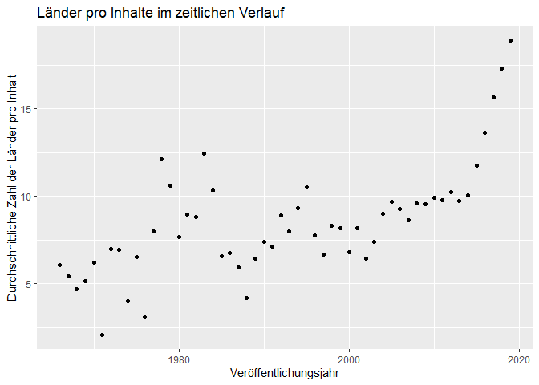
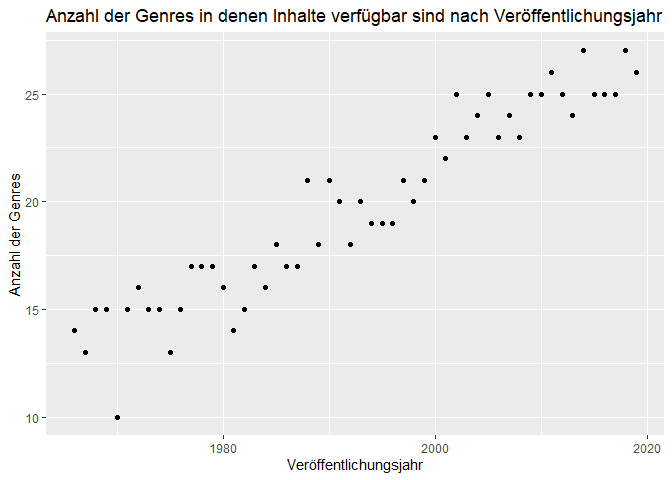
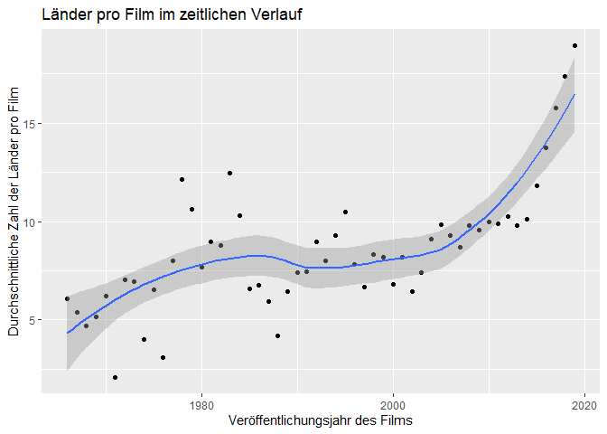
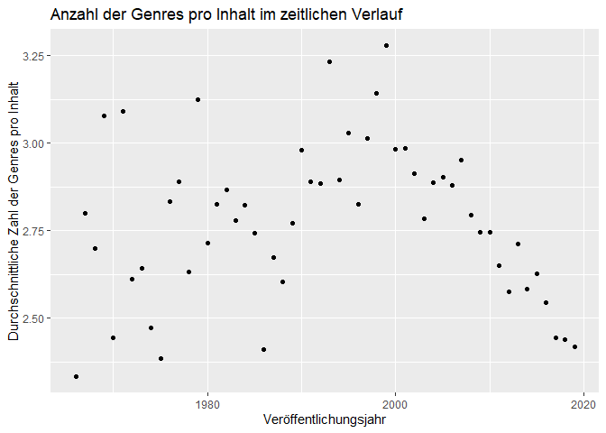

R-Projekt
================
Márk Reichmann, Simon Keil, Daniel Henke

Fragestunde: reicht eine Regression?

*Netflix im zeitlichen Verlauf*

-   Einleitung:

    -   wie verändert sich das neuere vs ältere material aus Netflix?
        (release year, not Neflix release Year!) (Daniel)

-   Explorativ:

    -   Datenbasis umstellen:
        -   wir betrachten nur spalten ohne NA werte
        -   varaiblen: titel, release_date, Genre(getrennt),
            land(getrennt)
    -   anzahl Filme pro Land (balkendiagramm/blaue punkte ?)
    -   länder pro film im zeitlichen Verlauf(Daniel)
    -   genre (Márk)
    -   release Year vs genre Genres (Márk)
    -   Jahr vs Anzahl Genre (verfügbar auf Netflix)(Márk)
    -   Jahr vs Anzahl Genre (pro film) (neueren Filme nicht vielen
        Genren zugeordnet) (Márk)

-   Methoden

    -   lineare regression, was ist das? (Simon)
    -   falls in 4. was besonderes, dann noch ergänzen
    -   pure exzellenz: lineare regression wird durch least squares
        bestimmt (vgl Bornemann, literatur :))

-   Analyse

    -   y-achsenabschnitt relativ witzloß (Simon)
    -   lineare regression (mit residuen, koeffizienten(pro jahr wie
        viele genres durchschnittlich)) \[macht der computer\]
    -   beschreibung, was wir sehen
    -   kritisch hinterfragen, ob netflix spezifisch (Daniel)

## Einleitung

Als 1997 ein kleine Online-Videothek für DVDs in Kalifornien gegründet
wurde, war niemanden klar, wie dieses Unternehmen die Welt verändern
würde. Jetzt, knapp 25 Jahre später, ist Netflix der größte
Video-on-Demand-Anbieter der Welt mit knapp 200 Millionen Abonnenten
\[1\]. Der Streaming-Riese ist heute in mehr als 190 Ländern verfügbar
und hat tausende Inhalte in verschieden Sprachen \[2\].

Doch Netflix ist nicht gleich Netflix: Netflix ist regional aufgrund von
unterschiedlichen Lizenzvereinbarungen und kultureller Unterschiede zum
Teil sehr unterschiedlich. Was man auf Netflix Deutschland gucken kann,
muss nicht bei Netflix USA verfügbar sein. Dies wollen wir im folgenden
Bericht genauer untersuchen und diese Unterschiede herausarbeiten. Denn
wir wollen herausfinden: **Welches Land hat das beste Netflix?**

Hierzu haben wir Daten von Kaggle, genauer gesagt von Ashish Gupta,
unter
<https://www.kaggle.com/ashishgup/netflix-rotten-tomatoes-metacritic-imdb>.
Da es keine offizielle Netflix API gibt, wurden hier Daten von mehreren
verschiedenen APIs und Seiten wie “Rotten Tomatoes”, “iMDB” und weiteren
Quellen zusammengetragen. Zudem hat er eine eigene Metrik, den “Hidden
Gem Score”, hinzugefügt, der aus den Daten Geheimtipps ermitteln soll.
Diesen haben wir aber für unsere Betrachungen nicht beachtet.

Aufgrund der Heterogenität der Daten sind manche Variablen
vertrauenswürdiger als andere. Zum Teil scheinen die Sprachen nicht
akurat zu sein, auch Sprachen wie “Latin” werden genannt, die wir in
keinem Film auf Netflix finden konnten. Wir vermuten Übersetzungsfehler,
können aber den Fehlerursprung nicht eindeutig ermitteln. Zum Teil sind
auch bei Zusammenfügen der Daten aus verschiedenen Quellen Fehler
aufgetreten. So ist bei der Serie “Barberen??????” die Netflix-Serie
deutscher Herkunft mit dem iMDB-Eintrag tschechischen Film ???? aus 20??
verbunden wurden. So sind die Daten zum Teil von der Serie, zum Teil vom
Film.

Da dies aber (nach unserem Wissen) Einzelfälle sind und es zu diesem
Thema kaum bis keine besseren Daten gibt, haben wir trotz dieser
Probleme dieses Datenset verwendet.

## Explorative Datenanalyse

Zunächst einmal lesen wir die Daten ein, und bringen sie auf ein
Brauchbares Format. Uns interessieren vor allem die Variablen “Title”,
“Genre”, “Country Availability” und “Release Date”. Dabei teilen wir die
Einträge in “Country Availability” und “Release Date” in mehrere Zeilen
auf.

``` r
library("tidyverse")
data <- read_csv("Data/netflix-rotten-tomatoes-metacritic-imdb.csv")

data_films <- data %>%
  select('Release Date', 'Title', 'Genre', 'Country Availability') %>%
  rename(Release = 'Release Date', Country = 'Country Availability') %>% 
  drop_na() %>%
  arrange(Title) %>%
  separate_rows(Genre, sep = ", ") %>%
  separate_rows(Country, sep = ",")

write.csv(data_films , file = "Data\\data_films.csv", row.names = FALSE)
```

und jetzt können wir mit unseren Daten loslegen:

``` r
myData <- read_csv("Data/data_films.csv")
```

|                                                                                                                                                                                                                                                                                                                                                                                                                                                                                                                                                                                                                                                                                                                                                                                                                                                                                                                                                                                                                                                                                                                                                                                                                                                                                                                                                                                                                                                                                   |
|-----------------------------------------------------------------------------------------------------------------------------------------------------------------------------------------------------------------------------------------------------------------------------------------------------------------------------------------------------------------------------------------------------------------------------------------------------------------------------------------------------------------------------------------------------------------------------------------------------------------------------------------------------------------------------------------------------------------------------------------------------------------------------------------------------------------------------------------------------------------------------------------------------------------------------------------------------------------------------------------------------------------------------------------------------------------------------------------------------------------------------------------------------------------------------------------------------------------------------------------------------------------------------------------------------------------------------------------------------------------------------------------------------------------------------------------------------------------------------------|
| Zunächst schauen wir uns an, wieviele Filme und Serien es pro Land gibt und in wievielen Ländern Filme und Serien verfügbar sind.                                                                                                                                                                                                                                                                                                                                                                                                                                                                                                                                                                                                                                                                                                                                                                                                                                                                                                                                                                                                                                                                                                                                                                                                                                                                                                                                                 |
| \`\`\`r title_country \<- data%>% select(‘Country Availability’, Title) %>% rename(country = ‘Country Availability’) %>% separate_rows(country, sep = “,”) %>% drop_na()                                                                                                                                                                                                                                                                                                                                                                                                                                                                                                                                                                                                                                                                                                                                                                                                                                                                                                                                                                                                                                                                                                                                                                                                                                                                                                          |
| n_ger \<- (title_country %>% filter(country == “Germany”) %>% count())$n                                                                                                                                                                                                                                                                                                                                                                                                                                                                                                                                                                                                                                                                                                                                                                                                                                                                                                                                                                                                                                                                                                                                                                                                                                                                                                                                                                                                          |
| title_country%>% count(country)%>% select(n, country)%>% ggplot(aes(x = n, y = reorder(country, n), colour = n))+ geom_point()+ labs(title = “Anzahl verfügbarer Filme in verschiedenen Ländern”, x = “Anzahl der Filme”, y = ” “)                                                                                                                                                                                                                                                                                                                                                                                                                                                                                                                                                                                                                                                                                                                                                                                                                                                                                                                                                                                                                                                                                                                                                                                                                                                |
| title_country %>% count(country) %>% ggplot(mapping = aes(x = n)) + geom_histogram(bins = 10) + annotate(geom = “vline”, x = n_ger, xintercept = n_ger) + annotate(geom = “text”, label = “Deutschland”, x = n_ger, y = 5, angle = -90, vjust = -0.5) + labs(title = “Anzahl Filme die pro Land verfügbar sind”, y = “ist in so vielen Ländern verfügbar”, x = “diese Anzahl Filme”)                                                                                                                                                                                                                                                                                                                                                                                                                                                                                                                                                                                                                                                                                                                                                                                                                                                                                                                                                                                                                                                                                              |
| title_country %>% count(Title) %>% ggplot(mapping = aes(x = n)) + geom_histogram(boundary = 0, bins = 95) + labs(title = “wieviele Filme gibt es, die in genau X-vielen Ländern verfügbar sind?”, x = “Anzahl Länder”, y = “Anzahl Filme, die so oft verfügbar sind”) \`\`\`                                                                                                                                                                                                                                                                                                                                                                                                                                                                                                                                                                                                                                                                                                                                                                                                                                                                                                                                                                                                                                                                                                                                                                                                      |
|                                                                                                                                                                                                                                                                                                                                                                                                                                                                                                                                                                                                                                                                                                                                                                                                                                                                                                                                                                                                                                                                                                                                                                                                                                                           |
| Nun untersuchen wir die Genres                                                                                                                                                                                                                                                                                                                                                                                                                                                                                                                                                                                                                                                                                                                                                                                                                                                                                                                                                                                                                                                                                                                                                                                                                                                                                                                                                                                                                                                    |
| \`\`\`r data %>% drop_na %>% select(Genre) %>% separate_rows(Genre, sep = “,”) %>% count(Genre) %>% arrange(desc(n)) %>% slice(1:10) %>% ggplot(aes(x = factor(Genre, levels = Genre), y = n)) + geom_bar(stat = ‘identity’) + labs(title = “Top 10 der Genre”, x = “Genre”, y = “Anzahl”) + theme(axis.text.x = element_text(angle = 45, hjust=1))                                                                                                                                                                                                                                                                                                                                                                                                                                                                                                                                                                                                                                                                                                                                                                                                                                                                                                                                                                                                                                                                                                                               |
| data %>% drop_na %>% rename(Country = ‘Country Availability’) %>% select(Genre, Country) %>% separate_rows(Country, sep = “,”) %>% separate_rows(Genre, sep = “,”) %>% filter(Country == ‘Germany’) %>% count(Genre) %>% arrange(desc(n)) %>% slice(1:10) %>% ggplot(aes(x = factor(Genre, levels = Genre), y = n)) + geom_bar(stat = ‘identity’) + labs(title = “Top 10 der Genre in Deutschland”, x = “Genre”, y = “Anzahl”) + theme(axis.text.x = element_text(angle = 45, hjust=1)) \`\`\`                                                                                                                                                                                                                                                                                                                                                                                                                                                                                                                                                                                                                                                                                                                                                                                                                                                                                                                                                                                    |
|                                                                                                                                                                                                                                                                                                                                                                                                                                                                                                                                                                                                                                                                                                                                                                                                                                                                                                                                                                                                                                                                                                                                                                                                                                                                                                                                   |
| Plots zu country und genre                                                                                                                                                                                                                                                                                                                                                                                                                                                                                                                                                                                                                                                                                                                                                                                                                                                                                                                                                                                                                                                                                                                                                                                                                                                                                                                                                                                                                                                        |
| \`\`\`r # vektoren mit zeilennamen zum einfacheren Kopieren # c(colnames(data))                                                                                                                                                                                                                                                                                                                                                                                                                                                                                                                                                                                                                                                                                                                                                                                                                                                                                                                                                                                                                                                                                                                                                                                                                                                                                                                                                                                                   |
| columns_data = c(“Title”, “Genre”, “Tags”, “Languages”, “Series or Movie”, “Hidden Gem Score”, “Country Availability”, “Runtime”, “Director”, “Writer”, “Actors”, “View Rating”, “IMDb Score”, “Rotten Tomatoes Score”, “Metacritic Score”, “Awards Received”, “Awards Nominated For”, “Boxoffice”, “Release Date”, “Netflix Release Date”, “Production House”, “Netflix Link”, “IMDb Link”, “Summary”, “IMDb Votes”, “Image”, “Poster”, “TMDb Trailer”, “Trailer Site”)                                                                                                                                                                                                                                                                                                                                                                                                                                                                                                                                                                                                                                                                                                                                                                                                                                                                                                                                                                                                          |
| columns_countries = c(“Argentina”, “Australia”, “Belgium”, “Brazil”, “Canada”, “Colombia”, “Czech Republic”, “France”, “Germany”, “Greece”, “Hong Kong”, “Hungary”, “Iceland”, “India”, “Israel”, “Italy”, “Japan”, “Lithuania”, “Malaysia”, “Mexico”, “Netherlands”, “Poland”, “Portugal”, “Romania”, “Russia”, “Singapore”, “Slovakia”, “South Africa”, “South Korea”, “Spain”, “Sweden”, “Switzerland”, “Thailand”, “Turkey”, “United Kingdom”, “United States”)                                                                                                                                                                                                                                                                                                                                                                                                                                                                                                                                                                                                                                                                                                                                                                                                                                                                                                                                                                                                               |
| #——————————————————- sort_by_country \<- data%>% select(“Title”, “Genre”, “Country Availability”)%>% separate_rows(`Country Availability`, sep = “,”)%>% separate_rows(Genre, sep = “,”)%>% count(Genre, `Country Availability`)%>% spread(key = `Country Availability`, value = n)%>% select(-“<NA>”)%>% # ab hier bringe ich die NA werte in ordnung filter(!is.na(Genre))%>% replace(is.na(.), 0) #sort_by_country                                                                                                                                                                                                                                                                                                                                                                                                                                                                                                                                                                                                                                                                                                                                                                                                                                                                                                                                                                                                                                                             |
| #——————————————————-                                                                                                                                                                                                                                                                                                                                                                                                                                                                                                                                                                                                                                                                                                                                                                                                                                                                                                                                                                                                                                                                                                                                                                                                                                                                                                                                                                                                                                                              |
| # weltweit durchgezählt: wie groß ist der Anteil an Horror, Drama, … von allen Medien auf Netflix? weltweit = data%>% separate_rows(Genre, sep = “,”)%>% count(Genre)%>% drop_na()%>% mutate(“prozent” = n/sum(n))%>% arrange(desc(prozent)) #weltweit                                                                                                                                                                                                                                                                                                                                                                                                                                                                                                                                                                                                                                                                                                                                                                                                                                                                                                                                                                                                                                                                                                                                                                                                                            |
| # Durchschnitt von: # wie groß ist Anteil an Horror, … in einem speziellen Land? durchschnitt = sort_by_country%>% mutate(n = rowSums(sort_by_country\[ , columns_countries\]))%>%#alle länder aufsummieren select(Genre, n)%>% drop_na()%>% mutate(n = as.integer(n))%>% mutate(“prozent” = n/sum(n))%>% arrange(desc(prozent)) #durchschnitt #———————                                                                                                                                                                                                                                                                                                                                                                                                                                                                                                                                                                                                                                                                                                                                                                                                                                                                                                                                                                                                                                                                                                                           |
| for(i in columns_countries){                                                                                                                                                                                                                                                                                                                                                                                                                                                                                                                                                                                                                                                                                                                                                                                                                                                                                                                                                                                                                                                                                                                                                                                                                                                                                                                                                                                                                                                      |
| specific_country \<- sort_by_country%>% select(Genre, i)%>% drop_na()%>% mutate(“prozent” = !!as.symbol(i)/sum(!!as.symbol(i)))# ich rufe die gewünschte Spalte auf, obwohl ich nur einen Stig zur Verfügung habe                                                                                                                                                                                                                                                                                                                                                                                                                                                                                                                                                                                                                                                                                                                                                                                                                                                                                                                                                                                                                                                                                                                                                                                                                                                                 |
| #reorder(Genre, prozent) my_plot = ggplot(NULL, aes(x = prozent, y = reorder(Genre, prozent))) + # Draw ggplot2 plot based on two data frames geom_col(data = durchschnitt) + geom_point(data = specific_country, col = “orange”)+ scale_x\_continuous(limits = c(0, 0.2))+ labs(title = i, x = “Genre/im Land verfügbar”, y = ” “)                                                                                                                                                                                                                                                                                                                                                                                                                                                                                                                                                                                                                                                                                                                                                                                                                                                                                                                                                                                                                                                                                                                                               |
| print(my_plot) } \`\`\`                                                                                                                                                                                                                                                                                                                                                                                                                                                                                                                                                                                                                                                                                                                                                                                                                                                                                                                                                                                                                                                                                                                                                                                                                                                                                                                                                                                                                                                           |
| `r ggplot(NULL, aes(x = prozent, y = reorder(Genre, prozent))) +    # Draw ggplot2 plot based on two data frames geom_col(data = weltweit) + geom_point(data = durchschnitt, col = "orange")+ scale_x_continuous(limits = c(0, 0.2))+ labs(title = "weltweite Verteilung (bar)", x = "durchschnittliche Verteilung pro land (orange)", y = " ")` beobachtungen:                                                                                                                                                                                                                                                                                                                                                                                                                                                                                                                                                                                                                                                                                                                                                                                                                                                                                                                                                                                                                                                                                                                   |
| \- documentary, realyty tv und shorts sind ausreißer                                                                                                                                                                                                                                                                                                                                                                                                                                                                                                                                                                                                                                                                                                                                                                                                                                                                                                                                                                                                                                                                                                                                                                                                                                                                                                                                                                                                                              |
| -> Warscheinlich existieren insgesamt wenige Dokumentationen und Shorts, die dafür aber in viel mehr Ländern verfügbar sind damit fallen sie insgesamt nicht ins Gewicht, in einem land prozentual aber schon                                                                                                                                                                                                                                                                                                                                                                                                                                                                                                                                                                                                                                                                                                                                                                                                                                                                                                                                                                                                                                                                                                                                                                                                                                                                     |
| insgesamt gibt es etwa 6-mal so viele Dramen wie Documentaries, aber in den einzelnen Ländern sind es nur noch etwa 3-mal so viele                                                                                                                                                                                                                                                                                                                                                                                                                                                                                                                                                                                                                                                                                                                                                                                                                                                                                                                                                                                                                                                                                                                                                                                                                                                                                                                                                |
| \`\`\`r columns_generes = c(“Action”, “Adult”, “Adventure”, “Animation”, “Biography”, “Comedy”, “Crime”, “Documentary”, “Drama”, “Family”, “Fantasy”, “Film-Noir”, “Game-Show”, “History”, “Horror”, “Music”, “Musical”, “Mystery”, “News”, “Reality-TV”, “Romance”, “Sci-Fi”, “Short”, “Sport”, “Talk-Show”, “Thriller”, “War”, “Western”)                                                                                                                                                                                                                                                                                                                                                                                                                                                                                                                                                                                                                                                                                                                                                                                                                                                                                                                                                                                                                                                                                                                                       |
| sort_by_genre \<- data%>% select(“Title”, “Genre”, “Country Availability”)%>% separate_rows(`Country Availability`, sep = “,”)%>% separate_rows(Genre, sep = “,”)%>% count(Genre, `Country Availability`)%>% spread(key = Genre, value = n)%>% select(-“<NA>”)%>% # ab hier bringe ich die NA werte in ordnung filter(!is.na(`Country Availability`))%>% replace(is.na(.), 0) sort_by_genre \`\`\`                                                                                                                                                                                                                                                                                                                                                                                                                                                                                                                                                                                                                                                                                                                                                                                                                                                                                                                                                                                                                                                                                |
| `` ## # A tibble: 36 x 29 ##    `Country Availabilit~ Action Adult Adventure Animation Biography Comedy Crime ##    <chr>                  <int> <int>     <int>     <int>     <int>  <int> <int> ##  1 Argentina                914     2       630       591       199   1793   674 ##  2 Australia                932     4       611       607       224   1993   731 ##  3 Belgium                  971     2       679       639       220   1919   742 ##  4 Brazil                   896     2       617       575       196   1724   658 ##  5 Canada                  1022     4       645       617       225   2008   765 ##  6 Colombia                 904     2       623       575       199   1577   672 ##  7 Czech Republic          1002     5       660       568       250   2129   765 ##  8 France                   886     2       624       652       202   1848   656 ##  9 Germany                  972     4       679       593       233   1949   719 ## 10 Greece                   851     3       549       503       192   1816   642 ## # ... with 26 more rows, and 21 more variables: Documentary <int>, Drama <int>, ## #   Family <int>, Fantasy <int>, Film-Noir <int>, Game-Show <int>, ## #   History <int>, Horror <int>, Music <int>, Musical <int>, Mystery <int>, ## #   News <int>, Reality-TV <int>, Romance <int>, Sci-Fi <int>, Short <int>, ## #   Sport <int>, Talk-Show <int>, Thriller <int>, War <int>, Western <int> `` |
| `` r sort_by_genre%>% select(`Country Availability`, Documentary, Drama) ``                                                                                                                                                                                                                                                                                                                                                                                                                                                                                                                                                                                                                                                                                                                                                                                                                                                                                                                                                                                                                                                                                                                                                                                                                                                                                                                                                                                                       |
| `` ## # A tibble: 36 x 3 ##    `Country Availability` Documentary Drama ##    <chr>                        <int> <int> ##  1 Argentina                      599  2068 ##  2 Australia                      644  2350 ##  3 Belgium                        586  2177 ##  4 Brazil                         591  2015 ##  5 Canada                         661  2405 ##  6 Colombia                       558  2056 ##  7 Czech Republic                 652  2534 ##  8 France                         577  2074 ##  9 Germany                        588  2229 ## 10 Greece                         600  2161 ## # ... with 26 more rows ``                                                                                                                                                                                                                                                                                                                                                                                                                                                                                                                                                                                                                                                                                                                                                                                                                                        |
| `r data%>% select("Title", "Genre")%>% separate_rows(Genre, sep = ", ")%>% count(Genre)%>% filter(Genre == "Documentary" | Genre == "Drama")`                                                                                                                                                                                                                                                                                                                                                                                                                                                                                                                                                                                                                                                                                                                                                                                                                                                                                                                                                                                                                                                                                                                                                                                                                                                                                                                                     |
| `## # A tibble: 2 x 2 ##   Genre           n ##   <chr>       <int> ## 1 Documentary  1030 ## 2 Drama        6359`                                                                                                                                                                                                                                                                                                                                                                                                                                                                                                                                                                                                                                                                                                                                                                                                                                                                                                                                                                                                                                                                                                                                                                                                                                                                                                                                                                |
| \- es scheinen sich eher die unbeliebteren Genres zu vertauschen - Deutschland ist voll im Durchschnitt und damit langweilig                                                                                                                                                                                                                                                                                                                                                                                                                                                                                                                                                                                                                                                                                                                                                                                                                                                                                                                                                                                                                                                                                                                                                                                                                                                                                                                                                      |
| \- halbwegs interessant finde ich: Japan, United States, South Africa, Mexico, Lithuania, Columbia (mehr oder weniger willkürliche Wahl)                                                                                                                                                                                                                                                                                                                                                                                                                                                                                                                                                                                                                                                                                                                                                                                                                                                                                                                                                                                                                                                                                                                                                                                                                                                                                                                                          |
| \- Show/ Filme unterscheiden (in wievielen Sprachen sind diese verfügbar?)                                                                                                                                                                                                                                                                                                                                                                                                                                                                                                                                                                                                                                                                                                                                                                                                                                                                                                                                                                                                                                                                                                                                                                                                                                                                                                                                                                                                        |
| evtl. wiederverwertbare Codeschnipsel                                                                                                                                                                                                                                                                                                                                                                                                                                                                                                                                                                                                                                                                                                                                                                                                                                                                                                                                                                                                                                                                                                                                                                                                                                                                                                                                                                                                                                             |

## Genre vs. Year

*Mein Vorschlag wäre hieran das Projekt aufzuziehen (\~Simon)*

Wir schauen uns an, welchen Anteil die Genres im Verlauf der Zeit haben.
Weil von vor 1965 und aus 2020/21 kaum Filme auf Netflix sind,
betrachten wir nur die Daten der Jahre 1965-2019:

``` r
genre_year <- data %>%
  separate_rows(Genre, sep = ", ") %>%
  mutate(year = as.integer(substr(`Release Date`, 8, 12))) %>% 
  filter(year >= 1965 & year < 2020) %>% 
  select(Genre, year) %>%
  drop_na()
year_per_genre<- genre_year %>%
  count(year, Genre)
year_genre_total <- genre_year %>% count(year)
left_join(year_per_genre, year_genre_total, by = "year") %>% 
  mutate(prop = n.x/n.y) %>% 
  ggplot(aes(x = year, y = prop, color = Genre)) + geom_point()
```

<!-- -->

Trotz (nzw. sogar wegen) des Overplotting sehen wir klar: Mit
zunehmender Jahreszahl gibt es mehr Genres und die einzelnen Genres
tendieren dazu einen kleineren Anteil auszumachen, denn die Punkte
liegen rechts unten im Plot am dichtesten. Zählen wir die Genres pro
Jahr erhalten wir einen annährend linearen Zusammenhang:

``` r
temp <- data %>%
  separate_rows(Genre, sep = ", ") %>%
  mutate(year = as.integer(substr(`Release Date`, 8, 12))) %>% 
  select(Genre, year) %>% 
  drop_na() %>%
  filter(year > 1960 & year < 2020) %>% 
  group_by(year) %>% 
  distinct() %>% 
  count(year)
temp %>% 
  ggplot(aes(x = year, y = n)) +
  geom_point() +
  geom_smooth(method = 'lm')

#lm <- lm(temp$year ~ temp$n)
#coef(lm)
#summary(lm)
```

<!-- -->

Allerdings wird in unserem Datensatz ein Film i.d.R. mehreren Genres
zugeordnet. Liegt der Zusammenhang also eventuell daran, dass neuere
Filme einfach mehr unterschiedlichen Genres zugeordnet werden? Um das zu
beantworten plotten wir die durchschnittliche Zahl der Genres denen ein
Film in einem gegebenen Jahr zugeordnet wird:

``` r
data %>%
  separate_rows(Genre, sep = ", ") %>%
  mutate(year = as.integer(substr(`Release Date`, 8, 12))) %>% 
  select(Genre, year, Title) %>% 
  filter(year > 1960 & year < 2020) %>% 
  drop_na() %>%
  count(Title, year) %>%
  group_by(year) %>% 
  summarise(number = mean(n)) %>% 
  ggplot(aes(x = year, y = number)) +
  geom_point() +
  labs(title = "Genres pro Film im zeitlichen Verlauf",
       y = "Durchschnittliche Zahl der Genres pro Film",
       x = "Jahr")
```

<!-- -->

Anhand des Plots lässt sich diese Vermutung widerlegen, denn die Zahl
der Genres ist fast immer zwischen 2.5 und .5, lediglich vor 1980 sieht
man etwas stärkere Schwankungen die vermutlich darauf zurückzuführen
ist, dass in diesen Jahren die Zahl der Filme die verfügbar sind relativ
klein ist. In den Filmen der letzten Jahre ist sogar eher ein
Abwärtstrend erkennbar.

An dieser Stelle ließe sich jetzt eine Analyse des linearen Modells
anschließen, die beiden “Überflieger”-Genres Drama und Comedy, die sich
etwas dem abfallenden Trend widersetzen könnte man näher beleuchten, man
könnte länderspezifisch die Analyse fortsetzen. Andere Variablen mit
einzubeziehen ist natürlich auch möglich.

Als überspannende Fragestellung ergibt sich hieraus zum Beispiel: Bietet
Netflix mit neuen Filmen mehr Abwechslung?

**Untersuchung Internationalität vs. Veröffentlichungsjahr**

*Ebenfalls spannend, evtl. als erweiterung zu Simons Idee (\~Daniel)*

Netflix wird immer internationaler und hat mehr und mehr
Eigenproduktionen. Führt das auf lange Sicht auf ein einheitlicheres
Netflix, das weniger regionale Unterschiede hat? Sind die neusten
Veröffentlichungen auf Netflix in mehr Ländern verfügbar?

Zunächst schauen wir uns die Film basierend auf ihr ursprüngliches
Veröffentlichungsjahr an, wobei wir ähnlich wie oben nur Filme zwischen
1960 und 2021 betrachten. Hier sehen wir eine interessante Kurve,
insbesondere wenn wir die in R eingebaute, automatische Glättungskurve
einbauen.

``` r
countriesPerYear <- data %>%
  separate_rows(`Country Availability`, sep = ",") %>%
  mutate(year = as.integer(substr(`Release Date`, 8, 12))) %>%  
  select(`Country Availability`, year, Title) %>% 
  drop_na() %>%
  filter(year > 1959 & year < 2021) %>% 
  count(Title, year) %>%
  group_by(year) %>% 
  summarise(number = mean(n)) 


countriesPerYear%>%
  ggplot(aes(x = year, y = number)) +
  geom_point() +
  labs(title = "Länder pro Film im zeitlichen Verlauf",
       y = "Durchschnittliche Zahl der Länder pro Film",
       x = "Veröffentlichungsjahr des Films")

countriesPerYear%>%
  ggplot(aes(x = year, y = number)) +
  geom_point() +
  geom_smooth()+
  labs(title = "Länder pro Film im zeitlichen Verlauf",
       y = "Durchschnittliche Zahl der Länder pro Film",
       x = "Veröffentlichungsjahr des Films")
```



Interessanterweise sieht man diesen Trend nicht so deutlich, wenn man
das Veröffentlichungsjahr auf Netflix betrachtet, da die Zahlen seit
2018 rückläufig sind.

``` r
data %>%
  separate_rows(`Country Availability`, sep = ",") %>%
  mutate(releaseYear = as.integer(substr(`Netflix Release Date`, 1, 4))) %>% 
  select(`Country Availability`, releaseYear, Title) %>% 
  drop_na() %>%
  filter(releaseYear > 1959 & releaseYear < 2021) %>%
  count(Title, releaseYear) %>%
  group_by(releaseYear) %>% 
  summarise(number = mean(n)) %>%
  ggplot(aes(x = releaseYear, y = number)) +
  geom_col() +
  labs(title = "Länder pro Film im zeitlichen Verlauf",
       y = "Durchschnittliche Zahl der Länder pro Film",
       x = "Veröffentlichungsjahr auf Netflix")
```

<!-- -->

Dieser Trend ist überraschend, vor allem im Vergleich zu den
Veröffentlichungszahlen von Filmen auf Netflix

``` r
  data %>%
  mutate(releaseYear = as.integer(substr(`Netflix Release Date`, 1, 4))) %>% 
  select(releaseYear, Title) %>% 
  drop_na() %>% 
  filter(releaseYear > 1959 & releaseYear < 2021) %>%
  ggplot(mapping = aes(x = releaseYear)) +
  geom_bar() +
  labs(title = "Veröffentlichungszahlen pro Jahr auf Netflix",
       y = "Anzahl",
       x = "Veröffentlichungsjahr auf Netflix")
```

<!-- -->

Das lässt darauf schließen: neue Werke sind auf Netflix internationaler
erhältlich als alte Werke, das Veröffentlichungsdatum auf Netflix spielt
höchstwahrscheinlich keine große Rolle.

=> Ideen zu betrachten: Erwartungswert Verfügbarkeit, Korrelationen
zwischen Verfügbarkeit, Netflix Release und ursprünglicher Release,
Modell zum Verlauf entwickeln…

## Literatur

\[1\] Statista Research Department (2021). *Netflix: Daten und Fakten
zur Erfolgsgeschichte des Streaming-Riesen*.
<https://de.statista.com/themen/1840/netflix/>

\[2\] Netflix. *Where ist Netflix available?.*
<https://help.netflix.com/en/node/14164>
