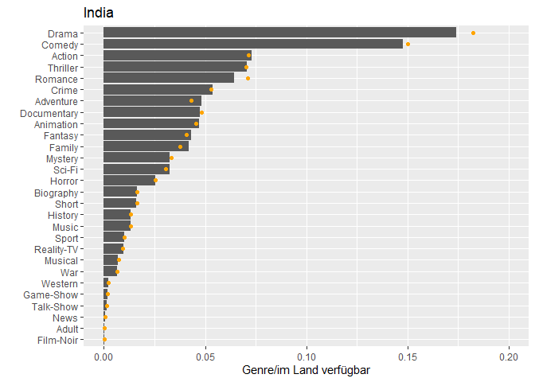
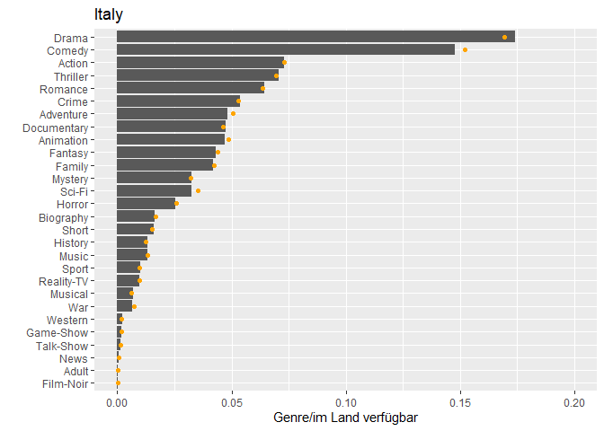
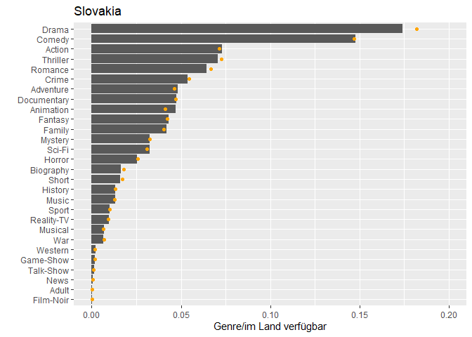
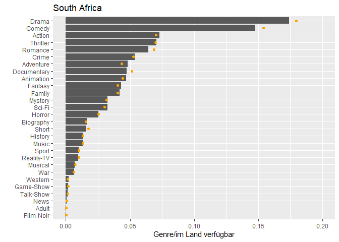
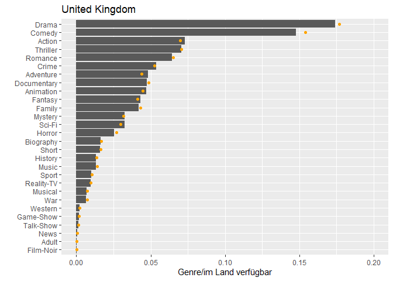

R-Projekt
================
Márk Reichmann, Simon Keil, Daniel Henke
6 1 2022

Die Daten sind von
<https://www.kaggle.com/ashishgup/netflix-rotten-tomatoes-metacritic-imdb>

Daten einlesen:

``` r
library("tidyverse")
data <- read_csv("Data/netflix-rotten-tomatoes-metacritic-imdb.csv")
```

bisherige Fragestellungen:

*Welches Land hat das beste Netflix?*

filme/Serien getrennt

    Land - einnahmen
          (in welhem Land verdient Netflix am meisten?)
    Sprache - bewerrtungen 
          (in welcher sprache gibt es den höchsten prozentsatz "guter" filme?)
    Land - Anzahl pro Genere
          (gibts mehr deutsche Krimis als Französische?)
    land - Schuspieler
          (sind in jedem land verschiedene Schauspieler beliebt?)
    Land - Sprache 
          (zB Finnland soll keine Synchros machen)

Achtung: Sprache evtl nicht vertrauenswürig

zB hypothesentest: ich glaube, deutschland schaut viele krimis, und
Finnland hat keine übersetzungen

Schätzer für Varianz, Erwartungswert

## Explorative Datenanalyse

Zunächst schauen wir uns an, wieviele Filme und Serien es pro Land gibt
und in wievielen Ländern Filme und Serien verfügbar sind.

``` r
title_country <- data%>%
  select('Country Availability', Title) %>% 
  rename(country = 'Country Availability') %>% 
  separate_rows(country, sep = ",") %>% 
  drop_na()


n_ger <- (title_country %>%
            filter(country == "Germany") %>%
            count())$n


title_country%>%
  count(country)%>%
  select(n, country)%>%
  ggplot(aes(x = n, y = reorder(country, n), colour = n))+
  geom_point()+
  labs(title = "Anzahl verfügbarer Filme in verschiedenen Ländern",
       x = "Anhahl der Filme", 
       y = " ")


title_country %>%
  count(country) %>% 
  ggplot(mapping = aes(x = n)) +
  geom_histogram(bins = 10) +
  annotate(geom = "vline",
           x = n_ger,
           xintercept = n_ger) +
  annotate(geom = "text",
           label = "Deutschland",
           x = n_ger,
           y = 5,
           angle = -90,
           vjust = -0.5) +
  labs(title = "Anzahl Filme die pro Land verfügbar sind",
       y = "ist in so vielen Ländern verfügbar",
       x = "diese Anzahl Filme")


title_country %>% 
  count(Title) %>%
  ggplot(mapping = aes(x = n)) +
  geom_histogram(boundary = 0, bins = 95) +
  labs(title = "wieviele Filme gibt es, die in genau X-vielen Ländern verfügbar sind?",
       x = "Anzahl Länder",
       y = "Anzahl Filme, die so oft verfügbar sind")
```


Nun untersuchen wir die Genres

``` r
data %>% 
  drop_na %>% 
  select(Genre) %>%
  separate_rows(Genre, sep = ", ") %>%
  count(Genre) %>% 
  arrange(desc(n)) %>% 
  slice(1:10) %>% 
  ggplot(aes(x = factor(Genre, levels = Genre), y = n)) +
  geom_bar(stat = 'identity') +
  labs(title = "Top 10 der Genre",
    x = "Genre",
    y = "Anzahl") +
  theme(axis.text.x = element_text(angle = 45, hjust=1))


data %>% 
  drop_na %>% 
  rename(Country = 'Country Availability') %>% 
  select(Genre, Country) %>%
  separate_rows(Country, sep = ",") %>%
  separate_rows(Genre, sep = ", ") %>%
  filter(Country == 'Germany') %>% 
  count(Genre) %>% 
  arrange(desc(n)) %>% 
  slice(1:10) %>% 
  ggplot(aes(x = factor(Genre, levels = Genre), y = n)) +
  geom_bar(stat = 'identity') +
  labs(title = "Top 10 der Genre in Deutschland",
    x = "Genre",
    y = "Anzahl") +
  theme(axis.text.x = element_text(angle = 45, hjust=1))
```


plots zu country und genere

``` r
# vektoren mit zeilennamen zum einfacherern kopieren
# c(colnames(data))

columns_data = c("Title", "Genre", "Tags", "Languages", "Series or Movie", "Hidden Gem Score", "Country Availability", "Runtime", "Director", "Writer", "Actors", "View Rating", "IMDb Score", "Rotten Tomatoes Score", "Metacritic Score", "Awards Received", "Awards Nominated For", "Boxoffice", "Release Date", "Netflix Release Date", "Production House", "Netflix Link", "IMDb Link", "Summary", "IMDb Votes", "Image", "Poster", "TMDb Trailer", "Trailer Site")

columns_countries = c("Argentina", "Australia", "Belgium", "Brazil", "Canada", "Colombia", "Czech Republic", "France", "Germany", "Greece", "Hong Kong", "Hungary", "Iceland", "India", "Israel", "Italy", "Japan", "Lithuania", "Malaysia", "Mexico", "Netherlands", "Poland", "Portugal", "Romania", "Russia", "Singapore", "Slovakia", "South Africa", "South Korea", "Spain", "Sweden", "Switzerland", "Thailand", "Turkey", "United Kingdom", "United States")

columns_generes = c("Action", "Adult", "Adventure", "Animation", "Biography", "Comedy", "Crime", "Documentary", "Drama", "Family", "Fantasy", "Film-Noir", "Game-Show", "History", "Horror", "Music", "Musical", "Mystery", "News", "Reality-TV", "Romance", "Sci-Fi", "Short", "Sport", "Talk-Show", "Thriller", "War", "Western")

#-------------------------------------------------------

sort_by_genre <- data%>%
  select("Title", "Genre", "Country Availability")%>%
  mutate(id = row_number())%>% # müssen eindeutig sein weil baum
  mutate("Yes" = TRUE)%>%
  separate_rows(Genre, sep = ", ")%>%
  spread(key = Genre, value = Yes)%>%
  select(Title, `Country Availability`, columns_generes)%>%
  separate_rows(`Country Availability`, sep = ",")
#sort_by_genre

sort_by_country <- data%>%
  select("Title", "Genre", "Country Availability")%>%
  mutate(id = row_number())%>% # müssen eindeutig sein weil baum
  mutate("Yes" = TRUE)%>% 
  separate_rows(`Country Availability`, sep = ",")%>%
  spread(key = `Country Availability`, value = Yes)%>%
  select(Title, Genre, columns_countries)%>%
  separate_rows(Genre, sep = ",")
#sort_by_country

#-------------------------------------------------------

weltweit = sort_by_country%>%
  count(Genre)%>%
  drop_na()%>%
  mutate("prozent" = n/sum(n))
#sum(weltweit$prozent)
#---------------------

for(i in columns_countries){
  
specific_country <- sort_by_country%>%
  filter(!!as.symbol(i) == TRUE)%>% # ich rufe die gewünschte Spalte auf, obwohl ich nur einen Stig zur verfügung habe
  count(Genre)%>%
  drop_na()%>%
  mutate("prozent" = n/sum(n))
#sum(specific_country$prozent)

my_plot = ggplot(NULL, aes(x = prozent, y = reorder(Genre, n))) +    # Draw ggplot2 plot based on two data frames
  geom_col(data = weltweit) +
  geom_point(data = specific_country, col = "orange")+
  labs(title = i,
       x = "Genre/gesamt", 
       y = " ")

print(my_plot)
}
```


beobachtungen:

-   warum zum kuckuck ist Documentary die ganze zeit so ein ausreisser??

-   short ist auch oft zu hoch

-> vllt muss statt dem weltweiten der durchschnitt der daten für die
spezifischen länder berechnet werden

-   es scheinen sich eher die unbeliebteren genres zu vertauschen

-   deutschland ist voll im Durchschnitt und damit langweilig

-   halbwegs interessant finde ich: Japan, United States, south africa,
    mexico, lithuania, columbia (mehr oder weniger willkürliche wahl,)
