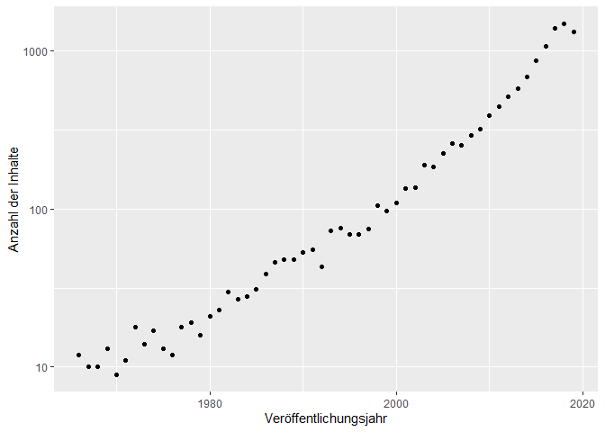
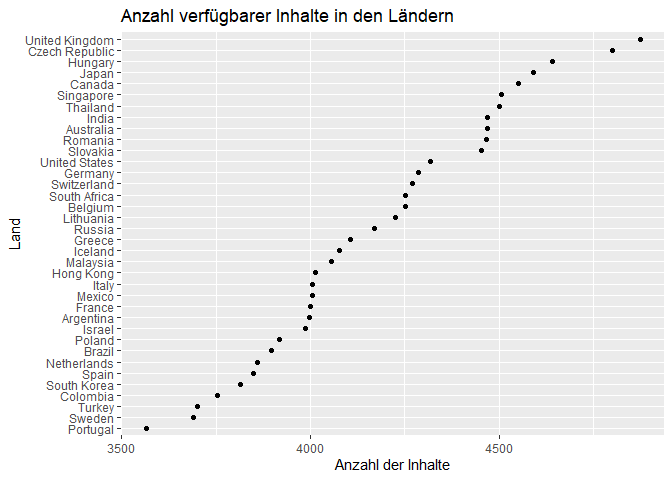
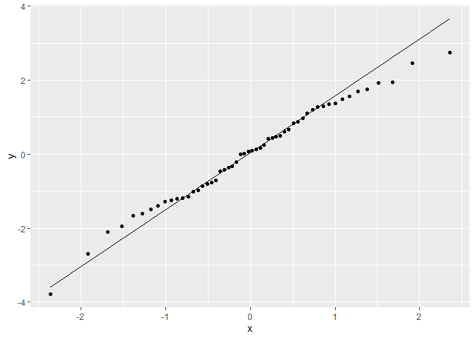

R-Projekt
================
Márk Reichmann, Simon Keil, Daniel Henke

## Einleitung

Als 1997 ein kleine Online-Videothek für DVDs in Kalifornien gegründet
wurde, war niemanden klar, wie dieses Unternehmen die Welt verändern
würde. Jetzt, knapp 25 Jahre später, ist Netflix der größte
Video-on-Demand-Anbieter der Welt mit knapp 200 Millionen Abonnenten
\[1\]. Der Streaming-Riese ist heute in mehr als 190 Ländern verfügbar
und hat tausende Inhalte in verschieden Sprachen \[2\].

Hierbei hat Netflix eine große Bandbreite an Filmen und Serien in
verschiedensten Genres und aus verschiedenen Jahren. Netflix kauft und
produziert Inhalte oft basierend auf intensiven Datenanalysen, sodass
ihr Sortiment keiner wahllosen Zusammenstellung sondern eher einer
kuratierten Auswahl gleicht \[3\].

Dadurch ist die Auswahl, welche Inhalte auf Netflix verfügbar sind und
wie diese im Zusammenhang mit Genre, Erscheinungsjahr und weiteren
Charakteristika zusammengestellt sind sehr spannend und weit mehr als
nur ein Querschnitt aller produzierten Inhalte. Insbesondere erweist
sich der Vergleich von älteren und neueren Inhalten als interessant.
Deshalb wollen wir in diesem Bericht der Frage nachgehen: *Wie verhalten
sich die Inhalte auf Netflix bezüglich ihres Erscheinungsjahres?*

Hierzu benutzen wir einen Datensatz von Kaggle, den Ashish Gupta
zusammen- und zur Verfügung gestellt hat und der unter \[4\] abzurufen
ist. Da es keine offizielle Netflix-API gibt, wurden hier Daten von
mehreren verschiedenen APIs und Seiten wie “Rotten Tomatoes”, “iMDB” und
weiteren Quellen zusammengetragen. Zudem hat er eine eigene Metrik, den
“Hidden Gem Score”, hinzugefügt, der aus den Daten Geheimtipps ermitteln
soll. Diesen haben wir aber für unsere Betrachtungen nicht beachtet, da
es sich lediglich um einen aus den anderen Variablen erzeugten Wert
handelt.

Im Datensatz finden sich 29 Variablen pro Inhalt, die vom Titel über
verschiedene Genre-Variablen bis hin zu Regisseur und Schauspieler
reichen. Ebenfalls verfügbar sind die verfügbaren Sprachen, verschiedene
Bewertungsmetriken (von IMDb, Rotten Tomatoes, Metacritic) und weitere
Kenngrößen, mit denen wir uns nicht weiter befasst haben. Im Folgenden
haben wir vor allem das Veröffentlichungsjahr, die Genres und die
Länderverfügbarkeit sowie ihre Zusammenhänge untersucht.

Da die Daten aus unterschiedlichen Quellen kommen und somit sehr
heterogen sind, sind manche Variablen vertrauenswürdiger als andere.
Teilweise tauchen Filme und Serien mehrmals auf, um diese Duplikate
müssen wir uns speziell kümmern. Zum Teil scheinen die Sprachen nicht
vollständig richtig zu sein, da zum Beispiel auch “Latin” als Sprache
genannt wird, was wir durch manuelles Abgleichen mit Netflix nicht
bestätigen konnten. Wir vermuten Übersetzungsfehler, können aber den
Fehlerursprung nicht eindeutig ermitteln. Manchmal sind auch beim
Zusammenfügen der Daten aus verschiedenen Quellen Fehler aufgetreten. So
ist vermutlich bei der Serie “Barbarians” die Netflix-Serie deutscher
Herkunft mit dem iMDB-Eintrag des tschechischen Films “Barbarians” (im
Original “Varvari”) aus 2014 verbunden worden. Die Daten sind zum Teil
von der Serie, zum Teil vom Film.

Da dies aber (nach unserem Wissen) Einzelfälle sind und es zu diesem
Thema kaum bis keine besseren Daten gibt, haben wir trotz dieser
Probleme dieses Datenset verwendet. Um den Imperfektionen des
Datensatzes zusätzlich aus dem Weg zu gehen, haben wir uns zudem auf
Spalten konzentriert, die sehr vollständig sind und in denen uns keine
offensichtlichen Inkonsistenzen aufgefallen sind.

## Explorative Datenanalyse

*Anmerkung zu Beginn der Analyse:* Wir lesen vor der eigentlichen
Auswertung die Daten ein und reduzieren sie auf den Grund-Datenbestand,
den wir im Folgenden nutzen wollen: Die Spalten mit dem Titel, Genres,
Veröffentlichungsdatum und Länder Verfügbarkeit. Dabei enfernen wir
zudem alle Zeilen in denen Angaben fehlen sowie die Inhalte mit
Veröffentlichungsdatum vor 1965 und nach 2020, da in diesen Jahren nur
sehr wenige Einträge vorhanden sind, sodass keine sinnvollen Aussagen
getroffen werden können. Zudem entfernen wir, wie oben angesprochen,
Duplikate, indem wir Einträge mit gleichem Titel und
Veröffentlichungsjahr zu einem Eintrag zusammenfassen.

Zunächst schauen wir uns ein paar allgemeine Zahlen zu unserem
(aufgeräumten) Datensatz an. Wir beginnen mit einer statistischen
Übersicht zu den Veröffentlichungsjahren:

    ##    Min. 1st Qu.  Median    Mean 3rd Qu.    Max. 
    ##    1966    2008    2015    2011    2017    2019

Wir beobachten zum einen, dass nur noch Werte von 1961 bis 2019 im
Datensatz sind (wie oben begründet) und zum anderen, dass sehr viele
Inhalte aus den letzten Jahren stammen, allein 25% aus den Jahren 2017
bis 2019. Diese Beobachtung sieht man auch, wenn man die Zahl der
Inhalte in dem jeweiligen Veröffentlichungsjahr darstellt. Im Plot
zeichnet sich sogar ab, dass die Zahl der Inhalte annährend exponentiell
mit jüngerem Veröffentlichungsdatum steigt, weshalb die Anzahl im Plot
mit einer logarithmischen Skala versehen ist.

<!-- -->

Nun schauen wir uns die Länder in unserem Datensatz etwas genauer an. Es
gibt 36 Länder in unserem Datensatz. Eine interessante Kenngröße, die
wir für diese Länder betrachten können ist, wieviele Filme und Serien es
jeweils in den Ländern gibt.

<!-- -->

Man sieht, dass es starke Unterschiede zwischen den einzelnen Ländern
gibt und dass keine Gruppenbildung in z.B. Länder mit sehr viel und
Ländern mit weniger Inhalten zu erkennen ist. Eine naheliegende nächste
Frage ist, wie sich die verschiedenen Anzahlen zusammensetzen, also ob
sehr viele Inhalte in vielen Ländern verfügbar sind und im oberen Plot
bei benachbarten Ländern sich das Angebot nur minimal unterscheidet,
oder ob sich die Anzahl zwar wenig unterscheidet aber die tatsächlichen
Inhalte stark. Betrachten wir die Anzahl der Länder in denen einzelne
Inhalte verfügbar sind, wird deutlich, dass letzteres der Fall ist.

<!-- -->

Tatsächlich ist ein Großteil der Medien nur in einem einzigen Land
abrufbar, das Angebot von Netflix scheint also recht speziell auf
einzelne Länder zugeschnitten zu sein. Nur ganz rechts im Plot sehen wir
eine zweite Häufung mit rund 1500 sehr international verfügbaren
Inhalten.

Im Bezug auf unsere Forschungsfrage besonders spannend ist die Frage, ob
diese sehr internationalen Inhalte möglicherweise die neueren Inhalte
auf Netflix sind. Wir betrachten also die Internationalität in Bezug auf
das Veröffentlichungsdatum.

<!-- -->

Hier sehen wir eine interessante Korrelation, die auf eine stärkere
Internationalität hinweist, je neuer der Inhalt ist. Dieser Effekt wird
auch durch die geplottete Glättungskurve deutlich. (Diese wird mit einer
lokalen polynomiellen Regression (loess, siehe Dokumentation des
stats-package) erzeugt, worauf wir aber hier nicht näher eingehen
wollen.)

Zuletzt untersuchen wir noch die Genres. Dafür betrachten wir zuerst die
Anzahl der Inhalte die in dem jeweiligen der 27 Genres verfügbar sind.

<!-- -->

Wir beobeachten, dass Drama und Comedy die mit Abstand am weitesten
verbeiteten Genres sind, und das nur die Hälfte der Genres überhaupt
über 1000 zugeordnete Inhalte haben. Das bedeutet, dass es ein paar
wenige Genres denen sehr viele Inhalte zugeordnet sind gibt und
gleichzeitig eine große Breite an spezifischeren Genres mit weniger
Inhalten.

Um dieses Ranking der Genres nicht nur allgemein sondern abhängig vom
Veröffentlichungsjahr zu visualisieren, schauen wir uns den Anteil der
jeweiligen Genres an, den diese an allen Inhalten aus einem spezifischen
Veröffentlichungsjahr haben. Wir bekommen folgendes interessantes Bild:

<!-- -->

Zum einen stechen erneut die beiden “Überflieger” Drama und Comedy ins
Auge, die, mit wenigen Ausnahmen bei älteren Jahren, die beiden größten
Anteile stellen. Des Weiteren fällt im unteren rechten Bereich das
Auftreten von overplotting unangenehm auf. Doch trotz (bzw. sogar wegen)
des overplotting ist erkennbar, dass es mit zunehmender Jahreszahl mehr
Genres gibt und dass die einzelnen Genres dazu tendieren einen kleineren
Anteil auszumachen, denn der Bereich unten rechts sind genau die
jüngsten Jahre und die geringen Anteile. Wir visualisieren also die
Daten auf eine neue Art und Weise, um den Effekt deutlicher und ohne
overplotting herauszuarbeiten. Eine Möglichkeit wäre den
durchschnittlichen Anteil gemittelt über alle Genres pro Jahr
darzustellen. Wir wählen aber die reziproke Darstellung des selben
Zusammenhangs, das heißt wir betrachten die Anzahl der Genres pro
Veröffentlichungsjahr, in denen Inhalte verfügbar sind.

<!-- -->

Wir sehen einen annähernd linearen Zusammenhang, den wir im Folgenden
näher untersuchen wollen. Davor wollen wir aber noch ausschließen, dass
der Zusammenhang, den wir sehen, durch die Art unseres Datensatzes
induziert wird und keinen echten Zusammenhang abbildet, denn in unserem
Datensatz wird ein Film oder eine Serie in der Regel mehreren Genres
zugeordnet. Es könnte also sein, dass neuere Inhalte einfach mehr
unterschiedlichen Genres zugeordnet werden. Um das zu untersuchen,
plotten wir die durchschnittliche Zahl der Genres denen ein Film oder
eine Serie in einem gegebenen Jahr zugeordnet wird:

<!-- -->

Anhand des Plots lässt sich diese Vermutung widerlegen, denn die Zahl
der Genres bewegt sich fast immer zwischen 2.5 und 3, mit wenigen
Ausreißern. Bei den Inhalten der letzten Jahre ist sogar eher ein
Abwärtstrend erkennbar, im Gegensatz zu dem Aufwärtstrend der Zahl der
Genres.

## Methoden

Den annähernd linearen Zusammenhang, auf den wir in der explorativen
Analyse gestoßen sind, wollen wir genauer untersuchen. Hierfür gibt es
die statistische Methode der linearen Regression. Grundlage dafür ist
das lineare Regressionsmodell
*Y**i* = *β**x**i* + *α* + *ε**i* für 1 ≤ *i* ≤ *n*
mit *n* ∈ ℕ die Anzahl der Messwerte zu den Eingabestellen
*x**i*, in unserem Fall die Jahreszahlen, und den
beobachteten Zufallsvariablen *Y**i*, in unserem Fall die
Anzahl der Genres, sowie den Fehlertermen *ε**i* die
Normalverteilt sind mit Erwartungswert 0 und unbekannter endlicher
Varianz.

Um aus den Messwerten und den Beobachtungen der *Y**i* die
Koeffizienten *α* und *β* des linearen Modells zu berechnen, kann man
die Methode der kleinsten Quadrate benutzen, die die Summe der
quadratischen Abweichungen minimiert. Für den theoretischen Zusammenhang
der Koeffizienten mit empirischen Größen siehe \[5\], für eine in der
Regel numerisch stabile Berechnung der Koeffizienten siehe \[6\].

Da die tatsächliche Verteilung der Fehlerterme unbekannt ist, ist es
sinnvoll die konkreten Fehlerterme auf Normalverteilung hin zu
untersuchen. Das bedeutet für gegebene Messwerte *y**i* und
*α*, *β* berechnet durch die Methode der kleinsten Quadrate, betrachten
wir *e**i* = *y**i* − *β**x**i* − *α*
und wollen überprüfen, ob dieser Vektor als Realisierung einer
*N*(0,*σ*2) verteilten Zufallsvariable plausibel ist. Hierfür
gibt es den Shapiro-Wilk-Test, für Details der Konstruktion siehe \[7\],
der als Ausgabe eine Statistik *W* hat, die für unsere Zwecke aufgrund
einer zu großen Stichprobe wenig interessant ist, und einen *p*-Wert
hat, der angibt mit welcher Wahrscheinlichkeit man eine Stichprobe wie
*e**i* erhält unter der Annahme einer Normalverteilung. Liegt
der p-Wert nahe der eins, kann man von einer Normalverteilung ausgehen.

Um die Güte einer linearen Regression zu beurteilen

## Ergebnisse und Schlussfolgerungen

    ## 
    ##  Shapiro-Wilk normality test
    ## 
    ## data:  residuals$residual
    ## W = 0.98732, p-value = 0.8357

    ## [1] 2.105312e-15

<!-- -->

## Literatur

\[1\] Statista Research Department (2021). *Netflix: Daten und Fakten
zur Erfolgsgeschichte des Streaming-Riesen*.
<https://de.statista.com/themen/1840/netflix/>

\[2\] Netflix. *Where ist Netflix available?.*
<https://help.netflix.com/en/node/14164>

\[3\] Netflix. *How does Netflix license TV shows and movies?.*
<https://help.netflix.com/en/node/4976#>:\~:text=Netflix%20uses%20a%20variety%20of,shows%20and%20movies%20we%20suggest.

\[4\] Ashish Gupta. *Daten.*
<https://www.kaggle.com/ashishgup/netflix-rotten-tomatoes-metacritic-imdb>

\[5\] Rolles, S. (2021). Einführung in die Wahrscheinlichkeitstheorie
und Statistik. Vorlesungsskript TUM

\[6\] Bornemann, F. (2016). *Numerische lineare Algebra.* IV Kleinste
Quadrate. <https://doi.org/10.1007/978-3-658-24431-6>

\[7\] Shapiro, S. S., & Wilk, M. B. (1965). An Analysis of Variance Test
for Normality (Complete Samples). Biometrika, 52(3/4), 591–611.
<https://doi.org/10.2307/2333709>
